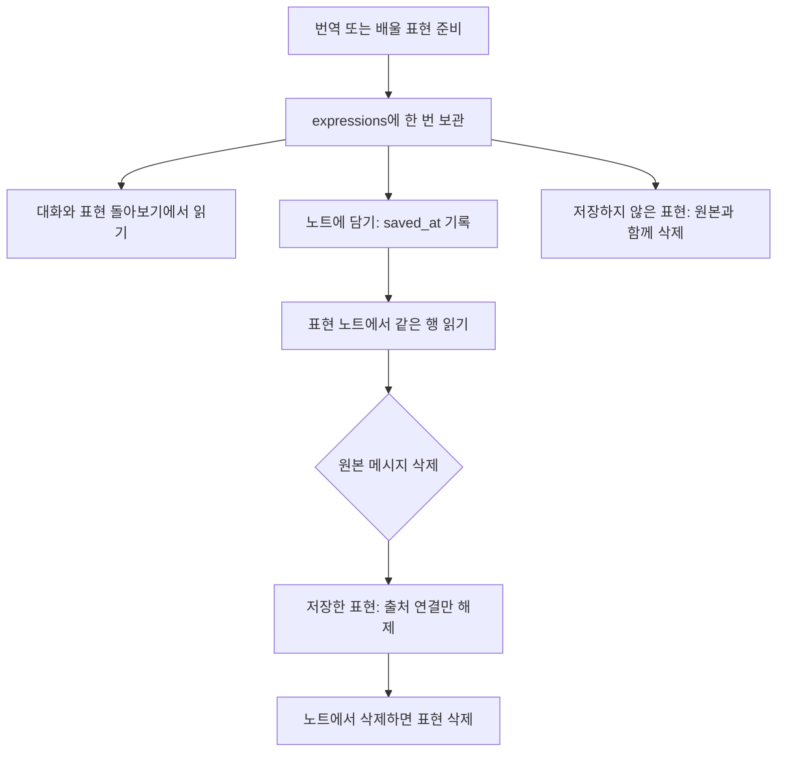

# 데이터베이스 구조 정리

## 목적과 승인 범위

모든 앱 테이블에서 생성·수정 시각을 같은 기준으로 확인하고, 번역·교정·표현 노트의 중복 저장과 호환용 데이터를 없앤다. 모호한 이름과 바뀔 수 있는 인물 이름에 기대는 식별 방식을 정리한다. 사용자는 기존 대화, 번역, 배울 표현, 노트와 플레이 기록을 그대로 이어서 사용한다.

2026-09-14 사용자가 공통 시각 열, 정리 후보와 표현 저장 통합을 승인했다. AI 응답 묶음과 그 안의 대사 위치는 유지하기로 했다. 사용자가 현재 실사용자가 없음을 확인하고, 구버전과의 호환 기간 없이 한 번에 전환하기로 했다. 같은 날 구현과 수락 기준 검증을 마쳤다. 범위와 근거는 아래 구현·검증 기록을 따른다.

제품 전제는 [PRODUCT.md](../../../PRODUCT.md)를 따른다. 영어 연습과 이야기 진행을 유지하며, 테이블을 줄이기 위해 번역·교정·노트 기능을 없애지 않는다.

## 필수 결정 계약

- [데이터베이스 공통 필드](../../decisions/database-common-fields.md): 공통 시각의 의미와 이름 규칙.
- [표현 저장 구조](../../decisions/expression-storage.md): 단일 표현, 저장 여부, 원본 삭제 뒤의 수명.
- [Supabase 스키마 작업 방식](../../decisions/supabase-schema-workflow.md): 선언형 원본, 마이그레이션, 기존 데이터 보존과 검증.
- [쓰기 규칙이 사는 자리](../../decisions/supabase-write-rules.md): 데이터 제약과 접근 권한의 책임.
- [스토리 구조](../../decisions/story-structure.md): 콘텐츠와 회차의 관계, 안정된 콘텐츠 ID.
- [AI 에피소드 프로토콜](../../decisions/ai-episode-protocol.md): 메시지 저장 단위, 표현 검사 완료, 번역의 중복 요청과 처리 수명.
- [인물 대사 번역](../../decisions/mobile-utterance-translation.md): 번역의 생성·복원과 회차 없는 첫 장면의 예외.
- [표현 노트](../../decisions/expression-note.md): 담기·취소·삭제, 카드 내용과 목록 순서.
- [에피소드 종료와 표현 돌아보기](../../decisions/episode-ending-and-review.md): 검사 결과의 구분, 종료와 다시 열기.
- [검증과 내부 테스트 배포](../../decisions/continuous-delivery.md): 배포 경로와 검증. 이번 작업의 구버전 호환 예외는 아래 전환 조건을 따른다.

## 확인한 현재 구조

선언형 스키마에는 앱 테이블이 14개 있다. `profiles`와 `app_version_policies`는 두 공통 시각 열을 모두 갖는다. `stories`, `episode_messages`, `saved_expressions`는 `created_at`만 갖고 나머지 9개는 두 열이 없다.

`utterance_meanings`는 대사 뜻과 생성 요청의 선점 상태를 보관한다. `episode_expression_results`는 검사 판정과 카드 내용을 보관한다. `saved_expressions`는 사용자가 담은 문장과 뜻을 복사한다. 같은 표현의 뜻이 여러 곳에 남는다.

`episodes.cast_names`는 인물 관계와 중복되는 호환용 목록이다. API가 아직 이 목록을 읽는다. `stories.cover_emoji`도 현재 화면에서 쓰지 않지만 API와 타입에 남아 있다. `language_levels`는 에피소드 종료 시 쓰며, 현재 앱·서버에는 읽는 경로가 없다.

이는 저장소 조사 결과다. 운영 데이터의 분포, 과거 뜻의 불일치와 실행 성능은 아직 확인하지 않았다.

## 요구 동작

### 공통 시각

현재와 변경 후의 모든 앱 테이블은 공통 필드 계약을 따른다. 표현의 생성 시각과 노트에 담은 시각을 구분하고, 노트 순서는 `saved_at`을 따른다. 번역을 오래전에 만들었어도 오늘 담으면 오늘 담은 위치에 보인다. 수정 시각이 바뀌어도 대화 순서, 회차 시작 시각과 연속 기록은 달라지지 않는다.

### 표현 한 번 저장

`utterance_meanings`와 `saved_expressions`의 역할을 `expressions`로 통합한다. 영어 교정과 한국어 입력 안내의 카드 내용도 이곳에서 한 번만 보관한다. 기존 검사 결과에 같은 문장·뜻·설명을 복사해 남기지 않는다.

| 값 | 의미 |
| --- | --- |
| `id`, `user_id` | 표현의 안정된 ID와 소유자 |
| `kind` | `dialogue`는 인물 대사, `correction`은 영어 교정, `translation`은 한국어 입력의 영어 안내 |
| `text`, `meaning` | 표시할 문장과 뜻 |
| `episode_id`, `message_id` | 에피소드와 출처 메시지. 메시지는 삭제 뒤 비어 있을 수 있다 |
| `dialogue_index` | 인물 말풍선의 0부터 시작하는 위치. 사용자 메시지의 배울 표현은 `NULL` |
| `saved_at` | 노트에 담은 시각. 담지 않았으면 `NULL` |
| `created_at`, `updated_at` | 공통 생성·수정 시각 |

인물 대사의 화자, 교정·안내의 원문과 수정 설명, 쓰는 상황, 예문과 예문 뜻을 보존한다. 종류별로 필요한 내용이 없는 표현을 완료된 카드나 노트 항목으로 노출하지 않는다. 생성 중인 선점과 생성된 표현은 구분한다.

검사 완료 상태는 표현 존재 여부로 추측하지 않는다. `natural`, `unclear`는 다시 열어도 완료 상태를 유지하며 카드와 노트 항목을 만들지 않는다. `episode_messages.expression_status`는 `NULL`, `provided`, `natural`, `unclear` 중 하나다. `provided`는 필요한 표현 내용과 함께 확정된다. `NULL`은 사용자 메시지에서는 완료된 판정 없음, AI 메시지에서는 검사 대상 아님을 뜻한다. 처리 중과 요청 실패는 완료 판정으로 저장하지 않는다. 판정 갱신은 메시지의 `updated_at`을 바꾸지만 본문 수정 표시와 대화 순서는 바꾸지 않는다. 서로 다른 계정의 메시지나 에피소드를 출처로 연결할 수 없다.

번역과 담기가 겹쳐도 같은 뜻을 중복 생성하지 않는다. 중복 저장 요청은 같은 표현과 저장 시각을 반환한다. 실패하거나 만료된 생성 요청 뒤에는 다시 시도할 수 있고, 늦은 응답이 새 결과나 삭제된 출처를 되살리지 않는다. 저장 취소는 대화의 번역·교정을 삭제하지 않는다.

### 이름과 중복 데이터

| 현재 | 목표 |
| --- | --- |
| `episodes.cast_names` | 제거. 인물과 에피소드의 관계만으로 화자를 읽는다 |
| `stories.cover_emoji` | 제거. 기존 표지 이미지와 빈 표지 동작을 유지한다 |
| `episode_characters.at` | `position`으로 통일. 기존 1부터 시작하는 순서를 보존한다 |
| `utterance_at` | `dialogue_index`로 통일. 기존 0부터 시작하는 대사 위치를 보존한다 |
| `saved_expressions.kind`의 `utterance`, `guidance` | `expressions.kind`의 `dialogue`, `translation`으로 변경. `correction`은 유지한다 |
| `episode_expression_results` | 제거. 판정은 메시지의 `expression_status`, 카드 내용은 `expressions`에 둔다 |
| `episode_messages.play_id` | `episode_play_id`로 명확하게 부른다 |
| 인물 이름으로 seed의 같은 행 찾기 | 이름·순서와 독립된 고정 식별자로 같은 인물을 찾는다 |

제거하거나 바꾼 이름은 최종 상태의 API 응답, 소비자와 타입에도 남기지 않는다. `situation_emoji`처럼 현재 화면에서 쓰는 다른 이모지는 제거하지 않는다. 인물 이름이나 순서를 고쳐 공식 콘텐츠를 다시 반영해도 기존 인물 ID와 에피소드 연결은 유지한다. 인물이 실제로 교체되는 경우를 단순 이름 변경으로 합치지 않는다.

### 유지할 구조

- `stories`, `characters`, `episodes`, `episode_characters`의 콘텐츠 관계와 `story_plays`, `episode_plays`의 회차 구분을 유지한다.
- AI 응답 하나는 여러 화자가 있어도 메시지 한 행이다. 대사별 메시지 행, 별도의 대사 테이블과 노트 연결 테이블을 추가하지 않는다.
- `language_levels`는 보존한다. 읽지 않는다는 이유만으로 제품이 요구한 계정 수준 기록을 삭제하지 않는다. 이를 활용하는 기능은 추가하지 않는다.
- `retired_usernames`는 이전 아이디 보호 기능 때문에 유지한다. 테이블 개수만을 줄이려는 합치기는 하지 않는다.

## 기존 데이터와 전환

- 모든 기존 노트 항목의 문장, 뜻, 설명, 출처와 저장 시각을 보존한다. 이미 원본이 없는 항목도 포함한다. 저장된 노트 ID는 유지하며, 통합으로 ID가 달라지는 다른 참조도 빠짐없이 대응한다.
- 같은 출처의 번역과 노트는 한 표현이 된다. 텍스트가 같다는 이유로 서로 다른 출처를 합치지 않는다.
- 기존 검사 결과의 `corrected`는 메시지의 `provided`로, `natural`과 `unclear`는 같은 이름의 메시지 상태로 옮긴다. 노트 종류의 `utterance`는 `dialogue`, `guidance`는 `translation`으로 옮기고 `correction`은 유지한다. 기존 검사 결과의 판정과 카드 내용, 예문·예문 뜻을 보존한다. 이행 중 모델을 다시 호출해 내용을 바꾸지 않는다.
- 과거 시각이 있으면 그 근거를 사용한다. 생성 시각을 알 수 없으면 전환 시각을 보완값으로 사용하고 실제 과거 생성 시각이 아니라는 한계를 기록한다. 과거 수정 이력이 없으면 새 수정 시각은 생성 시각과 같게 시작한다. 기존 `created_at`, 사건 시각과 노트 저장 순서는 바꾸지 않는다.
- 중복 원본을 제거하기 전에 모든 보존 대상이 새 구조에서 읽히는지 확인해야 한다. 데이터가 옮겨졌다는 확인 없이 테이블이나 열을 먼저 삭제하지 않는다.
- DB·API·앱을 하나의 변경 범위로 묶어 최종 구조로 한 번에 전환한다. 옛 테이블을 남긴 채 별도 출시로 제거하는 단계는 두지 않는다. 이중 쓰기, 구버전용 조회와 호환용 필드도 만들지 않는다. 유지할 테이블을 이관만을 위해 새로 복제하지 않는다.
- DB와 API 배포, 앱 갱신이 서로 다른 시점에 끝나는 것은 허용한다. 그 사이의 구버전 동작은 보장하지 않으며, 검증에는 새 구조에 맞는 앱을 사용한다. 실사용자가 없다는 이번 작업의 전제에 한정한 선택이며, 이후 배포의 일반 규칙으로 삼지 않는다.
- 데이터 변환과 옛 테이블·열 제거는 같은 전환에 포함한다. 변환 중 옛 데이터를 읽는 것은 가능하지만 전환 완료 후에는 최종 구조만 남는다. 기존 데이터 보존 검증과 선언형 마이그레이션 방식은 유지한다.
- 승인한 삭제는 중복 테이블·중복 열과 사용하지 않는 표지 이모지의 정리다. 사용자 노트, 학습 수준과 플레이 기록을 임의로 지우는 승인이 아니다.

## 수락 기준

1. 변경 후 모든 앱 테이블에서 두 공통 시각 열이 존재하고 `NULL`이 거부된다. 생성 시각은 변하지 않고, 실제 변경만 수정 시각에 반영된다. 연결과 처리 상태 테이블도 같은 기준을 통과한다.
2. 대사 두 개가 든 AI 메시지를 저장하고 다시 열면 메시지는 하나이고, 각 대사의 번역과 저장 표시가 정확한 말풍선에 붙는다.
3. 번역 후 담기, 담기 후 번역, 두 기기의 동시 번역·담기는 같은 출처의 표현 하나와 같은 뜻을 사용한다. 노트에 중복 항목이 생기지 않는다.
4. 오래된 번역을 새로 담으면 최근 저장 위치에 나온다. 중복 담기는 순서를 바꾸지 않고, 취소 후 다시 담기는 순서를 바꾼다.
5. 대화에서 책갈피 해제 또는 노트에서 삭제해도 원본이 남아 있으면 번역과 교정 카드는 유지된다. 원본이 없으면 저장 취소한 표현도 남지 않는다.
6. 원본 삭제 시 미저장 표현만 삭제되고, 저장한 표현은 내용·출처 표시를 유지한다. 다른 회차의 표현은 바뀌지 않는다. 계정 삭제는 해당 계정의 표현도 지운다.
7. 교정·안내는 대화, 돌아보기, 노트가 같은 내용을 읽는다. 사용자 메시지의 `provided`에는 하나의 `correction` 또는 `translation` 표현이 있고, `natural`, `unclear`에는 배울 표현이 없다. AI 메시지는 상태가 `NULL`이며 개별 대사의 번역은 `dialogue` 표현으로 남는다. 문제없음·뜻을 알 수 없음·실패·처리 중은 구별되며 카드의 부재만으로 재생성 여부를 판단하지 않는다.
8. 생성 실패, 만료 뒤 재시도, 원본 삭제와 생성 완료의 경합에서 불완전한 노트나 고아 표현이 남지 않는다. 다른 계정의 표현을 조회·수정·저장하거나 그 메시지를 출처로 연결할 수 없다.
9. 인물 이름과 순서를 바꿔 콘텐츠를 다시 반영해도 기존 ID와 화별 연결이 유지된다. 같은 콘텐츠의 재반영이 중복 인물이나 순서 충돌을 만들지 않는다.
10. 기존 노트만 있는 항목, 번역만 있는 항목, 둘 다 있는 항목, 원본 없는 노트와 모든 검사 판정이 전환 뒤 보존된다. 기존 기록과 대화 순서도 유지된다.
11. 한 번의 전환 뒤 최종 구조는 앱 테이블 12개이며 `utterance_meanings`, `saved_expressions`, `episode_expression_results`를 남기지 않는다. 선언형 스키마의 테이블·열·제약·정책 이름과 소비자에서 제거한 중복 데이터와 옛 이름이 사라진다. 과거 마이그레이션은 당시 이름을 유지한다. 스키마·보존 검사와 실제 번역·교정·담기·취소·다시 열기 검증이 통과한다. 검사 방식은 필수 결정 계약을 따른다.

## 가정과 남은 위험

- 에이전트 가정(사용자가 바꿀 수 있음): 최소 지원 버전 기능이 추가한 `app_version_policies`는 유지한다. 현재 14개에서 중복 테이블 3개를 없애고 `expressions` 하나를 더하면 12개다. 이미 갖춘 두 공통 시각 열과 정책 값·권한을 보존하고, 다른 앱 테이블과 같은 공통 필드 기준으로 검증한다. 테이블 수의 변경은 새 테이블 반영이며 승인한 통합 범위를 넓히지 않는다.

- 사용자 확인에 따라 현재 실사용자가 없다. 전환 중 구버전 앱·API의 일시적 실패를 허용한다. 출시 전에 실사용자가 생기면 이 전제를 다시 확인해야 한다.

- 실행자가 정한 기본값: 알 수 없는 생성 시각은 전환 시각으로 보완한다. 이 값으로 과거 생성 통계를 정확히 복원할 수 없다.
- 기존 두 저장소에 같은 출처의 서로 다른 뜻이나 카드 내용이 있을지는 미확인이다. 충돌 행을 한쪽 값으로 조용히 덮어쓰거나 삭제하지 않는다. 충돌이 있으면 원문을 보존하고 해당 행의 병합 결정을 별도로 확정해야 한다. 나머지 정상 데이터의 계약은 이 명세로 확정한다.
- 현재 성능 측정은 없다. 이번 효율화의 약속은 중복 저장·호환 경로·모호한 이름의 제거다. 조회 속도나 저장 용량의 개선 수치는 약속하지 않는다.
- 공통 수정 시각 갱신이 권한이나 메시지 순서를 바꾸지 않도록 확인해야 한다. 번역 생성의 임시 선점 상태와 영구 표현의 필수값도 서로 충돌하지 않아야 한다.

## 이번 범위 밖

- `language_levels` 삭제·프로필 통합 또는 개인화 기능 구현: 현재 저장 요구를 유지하며 활용 정책을 바꾸지 않는다.
- 메시지 순서 알고리즘의 변경과 [시각 동률 후속 기록](../../follow-ups/messages-sharing-a-timestamp-break-the-cut.md): 응답 저장 단위 유지와 별개의 결정이다.
- [타인 회차가 계정 삭제를 막는 문제](../../follow-ups/anothers-play-row-can-block-account-deletion.md)와 [직접 결말 기록 문제](../../follow-ups/signed-in-user-can-record-episode-endings-without-playing.md): 이번에 유지하는 테이블의 접근 정책 전반을 재설계하는 범위가 아니다. 표현 통합에 필요한 소유권 검사는 수락 기준에 포함한다.
- 새 UI, 표현 직접 편집, 다국어 기능, 감사 로그, 운영 DB 초기화와 직접 배포는 포함하지 않는다.

인물 식별 문제는 [기존 후속 기록](../../follow-ups/renaming-a-character-stops-the-seed.md)을 이 작업의 수락 기준으로 다룬다. 구현으로 해결되기 전에는 해결됐다고 기록하지 않는다.

## 구현과 검증 기록

- 2026-09-14: 수락 기준 9의 인물 식별을 고쳤다. 이름·순서 변경 뒤 실제 seed를 두 번 실행해 ID와 화별 연결을 확인했다. 관련 pgTAP 38개, 기존 데이터 보존 검사 3개와 선언형 스키마 일치가 통과했다. 이름 중복 제약은 트랜잭션 끝에서 확인해 이름 교환도 허용하며 중복 자체는 막는다.
- 2026-09-14: 유지할 11개 테이블에 공통 시각을 적용했다. 격리한 로컬 DB에서 전체 마이그레이션과 seed 재생, pgTAP 514개, 기존 데이터 보존 검사 24개, 생성 타입과 선언형 스키마 일치, workspace 타입 검사를 통과했다. 표현 통합과 나머지 수락 기준은 아직 구현 중이다.
- 공통 시각 마이그레이션은 선언형 diff로 생성했다. 생성기가 함수보다 늦게 교체하도록 낸 기존 트리거를 먼저 제거하도록 순서를 보완했다. 알려진 사건 시각으로 생성 시각을 채우고 수정 이력이 없는 행은 생성 시각과 같은 값으로 시작하는 DML과 API 역할의 함수 실행 권한 회수를 추가했다. 과거 시각을 알 수 없는 콘텐츠와 연결은 전환 시각을 사용한다.
- 2026-09-14: 표현 통합을 DB·API·모바일에 적용했다. `expressions`가 번역과 배울 표현, 노트 저장 여부를 보관하고 메시지가 검사 판정을 보관한다. 최종 앱 테이블은 12개다. 선언형 diff에 데이터 변환·보존 검사, 실제 열 이름 변경과 열 단위 권한 회수를 보완했다.
- 격리 DB에서 전체 재생·seed, pgTAP 555개, public DB lint, 생성 타입과 선언형 스키마 일치가 통과했다. 공통 시각·인물 식별·표현 통합의 기존 데이터 보존 검사는 각각 24·3·9개가 통과했다. workspace `check`, `check-types`, `test`도 통과했다.
- 실제 로컬 Auth·PostgREST를 쓰는 API 검사 7개가 통과했다. 동시 번역·담기의 모델 호출 1회, 저장된 뜻 재사용, 계정 격리, 실패 재시도, 실제 30초 만료와 오래된 요청의 실패, 생성 중 원본 삭제, 저장한 표현의 원본 없는 보존을 확인했다. 외부 모델 응답만 테스트 대역을 사용한다. 생성 중 원본 삭제 검사가 찾은 DB 오류 객체의 예외 처리 문제를 고친 뒤 다시 통과했다.
- 충돌 중단도 별도 격리 DB에서 확인했다. 표현 통합 바로 전 스키마에 보존 fixture를 넣고 노트의 뜻을 번역과 다르게 바꾼 뒤 실제 마이그레이션을 실행했다. 충돌 예외로 중단됐고 전후 `public` 전체 데이터 dump가 같았다. 공유 개발 DB나 운영 DB는 초기화하지 않았다.
- 전용 Supabase 리뷰는 기준 커밋 `47aa558`부터 공통 시각·인물 식별·표현 통합의 미커밋 변경까지 검토했고 수정이 필요한 문제는 없었다. 리뷰 당시 미확인한 충돌 중단은 위 실행으로 확인했다. 운영 규모의 잠금 시간은 측정하지 않았으며 성능 개선 수치는 주장하지 않는다.
- 커밋 `01586ea`에서 `bun scripts/ci/database.ts verify 47aa558 HEAD`가 통과했다. 새 마이그레이션 세 개의 보존 사례를 고른 뒤 전체 재생·lint·555개 pgTAP·생성 타입·스키마 일치까지 검사했다.
- Android의 실제 로컬 이메일 로그인부터 같은 `agent-device` 세션으로 확인했다. `우리 동네 카페` 1·2화에서 영어 교정, 한국어 입력 안내, 자연스러운 표현 판정, 번역, 저장·취소·재저장, 종료와 표현 돌아보기, 다음 화 진입을 확인했다. 앱 재시작 뒤에도 카드 내용과 노트 저장 순서가 유지됐다. 마지막 서버 수정 뒤에는 2화의 전체 흐름을 다시 확인했다. 실행 환경은 이 worktree의 API `http://127.0.0.1:3911`, Metro `http://127.0.0.1:8092`, Android `emulator-5556`이다.
- 한 메시지의 Mia·Owen 대사에 서로 다른 번역과 저장 표시가 복원되는 화면을 확인했다. 실제 DB에서도 해당 첫 장면은 메시지 한 행, 표현 두 행, 대사 위치 `{0,1}`, 저장 여부 `{false,true}`였다. 두 기기의 동시 요청은 실제 DB에 보내는 병렬 API 요청으로 검사했으며 두 물리 기기 동시 조작을 주장하지 않는다.
- iOS는 다른 `agent-device` 세션의 사용권과 충돌해 조작하지 않았다. [개발 기기 사용권 충돌](../../follow-ups/dev-session-assigns-agent-device-owned-simulator.md)에 원인과 다음 확인을 기록했다. 이번 화면 검증의 플랫폼 범위는 Android다.
- `implement`의 전체 변경 리뷰는 별도 읽기 전용 Codex 리뷰어가 `47aa558..01586ea`를 명세의 11개 기준과 필수 결정 계약에 대조해 완료했다. 수정이 필요한 발견 사항은 없었다. 로그인부터 로그아웃까지 Android 검증을 마치고 기기 검증 세션을 닫았다. 이 worktree의 API와 Metro는 직접 확인할 수 있도록 실행해 두었다.
- 고정 버전 squawk는 세 마이그레이션에 경고 46개를 보고했다. 기존 열의 기본값·제약, 잠금·인덱스, 이름 변경과 승인한 옛 열·테이블 삭제에 관한 경고다. 구버전 호환 중단과 데이터 보존은 이 명세의 승인 범위 및 실제 보존 검사로 다뤘다. 운영 규모의 잠금 시간은 별도로 측정하지 않았고 PR 승인 라벨을 붙이거나 원격에 푸시하지 않았다.

### 수락 기준별 근거

| 기준 | 확인한 근거 |
| --- | --- |
| 1 | `common_timestamps_test.sql`의 12개 테이블 필수 시각 열, 같은 값·시각 덮어쓰기·실제 변경 검사. 실제 DB의 12개 테이블 모두 같은 행별 INSERT·UPDATE 시각 트리거를 사용한다. |
| 2 | Android의 Mia·Owen 첫 장면 재진입, 실제 메시지·표현 행 수와 위치·저장 여부 대조. |
| 3 | `apps/api/integration/utterance-translation.test.ts`의 병렬 번역·담기, 모델 호출 1회와 저장된 뜻 재사용. Android의 번역·저장 순서별 확인. |
| 4 | `expressions_test.sql`의 중복 저장 시각 유지·취소 후 재저장 시각, API 노트 정렬 검사와 Android 재시작 후 노트 순서. |
| 5 | `expressions_test.sql`의 살아 있는 출처와 원본 없는 표현의 취소 차이. Android에서 취소 후 교정 카드와 번역 유지. |
| 6 | `saved_expressions_test.sql`, 계정 삭제 검사와 실제 API의 원본 삭제 뒤 노트 보존. 다른 메시지·회차의 표현 분리도 검사한다. |
| 7 | `episode_expression_results_test.sql`, `expressions_test.sql`의 판정·내용 원자성 및 실패 거부. Android 대화·돌아보기·노트의 같은 내용과 자연스러운 판정 복원. |
| 8 | 실제 API의 실패·30초 만료·오래된 실패·생성 중 삭제 경합, pgTAP의 잘못된 토큰·출처·계정·권한 거부. |
| 9 | 실제 seed의 이름·순서 변경과 반복 실행, 인물 보존 사례 3개. |
| 10 | `upgrade-tests/20260914092811/`의 노트만·번역만·둘 다·원본 없음·모든 판정 보존 사례 9개와 충돌 시 전체 원본 보존 실행. 공통 시각 보존 사례는 메시지 순서도 대조한다. |
| 11 | 커밋 기준 전체 DB 검증, 12개 테이블과 옛 테이블 제거 검사, workspace 검사 및 Android 실제 흐름. 과거 실행 결과와 마이그레이션의 옛 표기는 역사적 기록으로 유지한다. |
