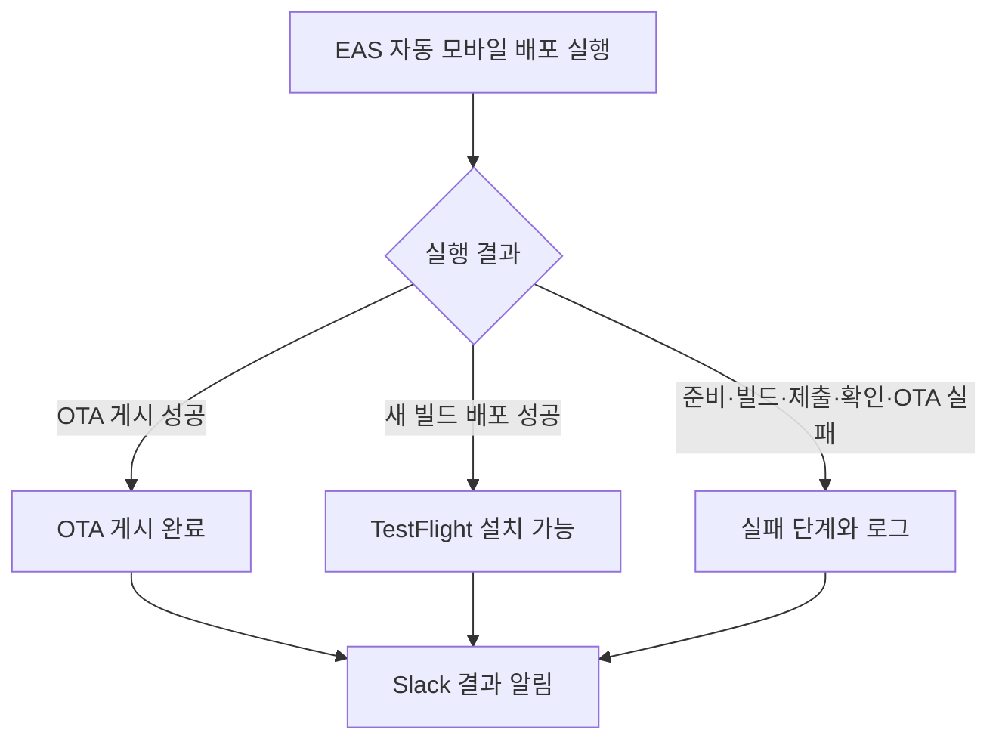

# 자동 모바일 배포 결과를 Slack으로 받기

## 사용자에게 보이는 결과

개발자는 EAS 화면을 계속 열어 두지 않아도 플린의 자동 모바일 배포 결과를
Slack에서 확인한다. 실패하면 어느 단계에서 멈췄는지 알고 해당 실행의 로그를 연다.
새 빌드 없이 OTA만 게시한 실행도 알림을 받는다.

사용자는 2026-09-14에 EAS Workflows에서 Slack으로 자동 모바일 배포의
Build·Submit·OTA 결과를 받는 범위를 확인했다. 이 명세는 앱 사용자의 기능을
바꾸지 않는다.

## 범위와 필수 근거

- 현재 자동 배포 대상인 iOS `Flyn Internal`과 `internal` 채널의 EAS 실행 결과를 알린다.
- EAS Workflows의 공식 Slack 연동과 Slack Incoming Webhooks를 사용한다.
  별도 알림 서버 없이 기존 모바일 배포 흐름에서 결과를 알릴 수 있어 선택했다.
- [검증과 내부 테스트 배포](../../decisions/continuous-delivery.md)를 필수로 읽는다.
  이 계약이 배포 대상, 승인, 순서, 성공 판정과 복구 경로를 정한다.
  알림은 그 결과를 전달하며 새 배포 승인이나 별도 배포 경로가 되지 않는다.

## 결과별 알림

| 확인한 결과 | 알림에서 알려 줄 내용 |
| --- | --- |
| 호환 빌드를 재사용해 OTA 게시 성공 | `OTA 게시 완료`, 대상 채널과 업데이트 링크 |
| 새 빌드를 만들고 제출한 뒤 설치 가능 확인 | `TestFlight 설치 가능`, 빌드 정보와 확인 링크 |
| 기존 빌드를 제출하고 설치 가능 확인 후 OTA 게시 성공 | `OTA 게시 완료`, 기존 빌드 제출 사실과 업데이트 링크 |
| 빌드 실패 | 빌드 실패, 해당 단계와 로그 링크 |
| 제출 실패 | 제출 실패, 빌드 성공 여부와 해당 단계의 로그 링크 |
| OTA 게시 실패 | OTA 게시 실패, 해당 단계와 로그 링크 |
| 준비 단계 또는 설치 가능 확인 실패 | 실패한 단계와 확인하지 못한 결과, 로그 링크 |

모든 알림에는 프로젝트, 플랫폼, 배포 커밋, EAS 실행 링크를 포함한다.
빌드가 관련되면 확인 가능한 앱 버전과 빌드 번호도 보여 준다.
아직 생성되지 않은 빌드나 업데이트의 링크와 버전은 만들어 넣지 않는다.
단계별 로그의 직접 링크가 없으면 EAS 실행에서 해당 단계를 찾을 수 있게 한다.

선택하지 않은 배포 경로를 건너뛴 것은 실패로 표시하지 않는다.
빌드 성공이나 제출 성공만으로 `TestFlight 설치 가능`을 보내지 않는다.
OTA 게시 완료를 모든 기기의 업데이트 적용 완료로 표현하지 않는다.
Apple 처리나 설치 가능 여부를 확인하다 멈추면 확인 실패로 알리고,
확인하지 않은 Apple 처리 결과를 단정하지 않는다.

## 알림 흐름

## 바꿀 수 있는 기본값

다음은 사용자가 따로 정하지 않은 에이전트 가정이다.

- 실행이 끝날 때 결과를 한 번 보낸다. 시작, 대기, 단계별 성공 알림은 보내지 않는다.
- 알림은 한 채널에 모으고 기본적으로 개인이나 채널 전체를 멘션하지 않는다.
- 같은 EAS 실행의 여러 배포 경로에서 중복 결과 알림을 만들지 않는다.
  새로 실행한 재시도는 별도 실행 링크로 구분한다.
- Slack 전송 실패는 배포 단계의 성공·실패와 구분해 실행 화면과 로그에 남긴다.
  알림 때문에 완료된 배포를 취소하거나 빌드·제출·OTA를 새로 실행하지 않는다.

## 수용 기준

- OTA만 게시한 실행과 새 Build·Submit 실행 모두 선택한 Slack 채널에서 결과를 확인한다.
- 기존 빌드 제출 후 OTA를 게시한 실행도 전체 결과를 한 번 알린다.
- 준비 단계, Build, Submit, 설치 가능 확인, OTA의 실패 사례에서
  성공 전용 조건 때문에 알림을 건너뛰지 않는다. 실패한 단계와 실행을 구분할 수 있다.
- 선택하지 않은 경로가 건너뛰어진 성공 사례에서 실패 알림을 보내지 않는다.
- 빌드 성공 후 Submit 또는 설치 가능 확인이 실패한 사례에서 설치 가능 알림을 보내지 않는다.
- 메시지의 커밋과 링크가 알림을 만든 실행과 일치한다.
- Webhook URL은 서버용 비밀값으로 보관하며 저장소, 앱 번들, 로그와 알림에 노출하지 않는다.
- Slack 오류를 재현하면 알림 실패를 확인할 수 있고 추가 배포가 생기지 않는다.
- 구현 검증은 상태별 메시지·실행 조건 검사와 실제 Slack 수신 확인을 구분해 기록한다.
  성공·실패 표본을 위한 알림 검증이 운영 배포를 고의로 실패시키거나 새로 시작하지 않는다.
  실제 배포에서 확인하지 못한 경로를 원격 검증 완료로 기록하지 않는다.

## 제외 범위와 미룬 사항

- 수동 EAS Build·Submit, PR 미리보기, Android와 다른 프로젝트의 알림은 제외한다.
  이번에 확인한 범위는 기존 자동 모바일 배포다.
- GitHub 검사나 DB·API 배포가 EAS 실행 전에 실패한 경우의 Slack 알림은 별도 범위다.
  이번 알림만으로 전체 CI 실패를 감지할 수 있다고 안내하지 않는다.
- 실행 전체 취소나 EAS 장애로 알림 작업 자체가 시작되지 않는 경우의 외부 감시는 미룬다.
  그동안 Slack 메시지가 없다는 사실을 배포 성공으로 보지 않는다.
- 알림 전달 재시도의 정확히 한 번 수신 보장, 메시지 수정과 스레드 추적은 제외한다.
  네트워크 응답 유실 때 중복될 수 있으므로 같은 실행 링크로 식별한다.
- Slack workspace와 채널은 실제 연결 때 사용자가 고른다.
  연결 전에는 알림 활성화나 실제 수신 검증이 끝났다고 하지 않는다.

## 공식 근거와 남은 확인

2026-09-14에 다음 원문과 현재 저장소를 확인했다. 문서 사본은 저장하지 않는다.
구현을 시작할 때 원문을 다시 읽는다.

- [Expo Slack 알림 안내](https://docs.expo.dev/tutorial/cicd/preview-builds/#slack-notifications):
  채널 Webhook, EAS 비밀 환경 변수와 공식 Slack 작업을 안내한다.
- [EAS 작업 정의](https://docs.expo.dev/eas/workflows/pre-packaged-jobs/#slack)와
  [현재 스키마](https://api.expo.dev/v2/workflows/schema):
  Slack 작업과 선행 작업 완료 후 알림 지원을 확인했다.
- [Slack Incoming Webhooks](https://docs.slack.dev/messaging/sending-messages-using-incoming-webhooks/):
  메시지 전송 형식, 고정 채널과 비밀 URL 취급의 근거다.
- EAS 공식 `eas-workflows` Skill은 이미 있으며 출처는 `expo/skills`다.
  [Expo 공식 Skill 안내](https://docs.expo.dev/skills/)로 공식 제공 여부를 확인했다.
- `find-skills` 검색에서 Slack Webhook 전용 공급자 공식 Skill은 확인하지 못했다.
  검색된 커뮤니티 Skill을 설치하지 않고 Slack 공식 문서를 작업 때 읽도록 연결했다.
- 현재 배포 설정은 `eas-cli@24.0.0`과 `sdk-57`을 사용한다.
  이번에는 공식 스키마만 확인했다. 실제 연동 설정의 CLI 서버 검증과 Slack 수신은
  구현 단계에 남아 있다. 공식 스키마나 고정 CLI가 필요한 동작을 지원하지 않으면
  검증 결과를 남기고 연동 방식을 다시 검토한다.
- Slack 전송 실패가 EAS 실행 전체 상태에 미치는 영향은 실제 구현에서 확인한다.
  기존 배포 복구가 알림 실패를 앱 배포 실패로 오해해 재배포하지 않는지 함께 검증한다.
