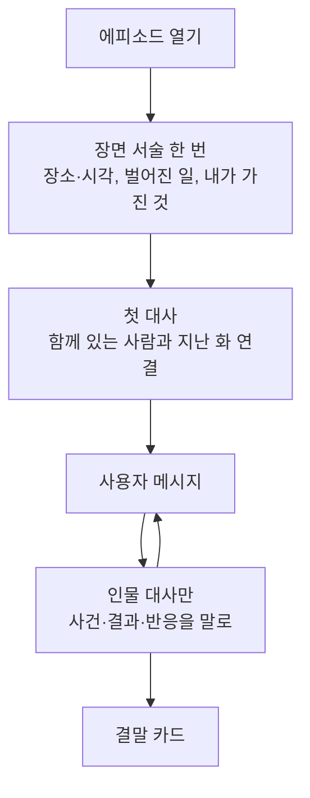

# 지문 없는 에피소드 대화

상태: 구현 준비됨. 2026-09-10에 사용자가 확인한 결정을 담는다.

## 사용자가 얻는 것

- 에피소드 대화가 영어 말풍선만으로 흐른다. 말풍선 사이에 한국어 지문이 끼어들지 않아 읽는 언어가 한 턴 안에서 바뀌지 않는다.
- 에피소드를 열면 첫 대사 위에서 장면을 한 번 읽는다. 어디에서 무슨 일이 났고 내 손에 무엇이 있는지 세 문장 안에 알고 대화를 시작한다.
- 사건의 결과와 상대의 반응이 상대의 말로 온다. 서술자가 내 행동을 대신 하지 않으므로 내가 말할 차례가 늘어난다.
- 두 인물이 번갈아 말하는 장면에서 이름표만으로 누가 말하는지 알아본다.

## 현재 문제와 근거

- 지금은 [에피소드 콘텐츠 제작](../../decisions/episode-authoring.md)에 따라 인물 대사는 영어, 행동과 상황은 한국어 지문으로 쓴다. 2화의 실제 화면 기록에서 한 턴에 지문이 두 번 끼어 언어가 일곱 번 바뀌었고, 사용자는 지문이 이해를 방해하고 인지 부하를 만든다고 관찰했다.
- 같은 기록에서 지문이 "사용자가 폰을 단말기에 대자"처럼 사용자의 행동을 대신 썼다. 프롬프트가 금지한 형식 위반이면서, 사용자가 영어로 말할 차례를 서술자가 가져간 사례다.
- 지문이 없으면 장소, 벌어진 일, 사용자만 아는 사실을 전할 자리가 사라진다. 이 셋은 인물이 대사로 말할 수 없으므로 도입의 장면 서술이 맡는다.
- 지문이 없으면 누가 말하는지를 이름표가 혼자 맡는다. 두 인물이 나오는 화에서 구분이 더 분명해야 한다.

## 범위와 동작

### 장면 서술

- 에피소드를 열면 대화 맨 위, 첫 말풍선 위에 한국어 장면 서술이 한 번 놓인다. 대화와 함께 스크롤되고, 다시 읽으려면 위로 올린다.
- 내용은 장소와 시각, 첫 대사 전에 벌어진 일, 사용자가 가진 것과 아는 것이다. 세 문장 이하로 쓰고 한 문장은 한 줄로 끝난다. 상황 줄이 이미 말하는 목표를 되풀이하지 않는다.
- 함께 있는 사람이 누구인지와 지난 화와의 연결은 장면 서술이 아니라 첫 대사가 맡는다. 어제 만난 사이라면 인물이 그렇게 말을 건다.
- 모양은 카드나 배경 없이 왼쪽 정렬이다. 글자 크기는 말풍선 본문과 같다. 첫 줄인 장소와 시각은 굵은 본문색이고, 나머지 줄은 본문보다 한 단계 옅되 충분히 대비되는 색이다. 왼쪽에 상황 줄과 같은 파랑 계열의 세로 줄을 둔다. 가운데 정렬과 기울임을 쓰지 않는다. 앞뒤 여백은 말풍선 사이 간격보다 조금 넓다.
- 밝은 화면과 어두운 화면에서 같은 위계로 읽힌다. 시스템 글자 크기를 키우면 줄이 늘어나되 잘리지 않는다.
- 장면 서술은 각본이 쓰고 모델은 쓰지 않는다. 한 에피소드에 하나이며, 대화 중간에는 나오지 않는다.

### 인물 대사

- 모델이 쓰는 장면은 인물 대사만이다. 이름 없는 줄을 쓰지 않는다.
- 세상의 사건과 그 결과는 인물이 말로 전한다. 단말기가 결제를 거절하면 인물이 그렇게 말하고, 새 잔이 나오면 인물이 건네며 말한다.
- 상대의 반응은 말투와 낱말에 실린다. 안도, 짜증, 망설임을 서술하지 않고 대사가 드러낸다.
- 인물은 사용자가 한 말에만 반응하고, 사용자가 말하지 않은 행동을 지어내지 않는다. 질문은 행동이 아니다. "폰으로 낼 수 있나요?"라고 물으면 인물은 방법을 안내하고 차례를 넘기며, 사용자가 폰을 댔다고 쓰지 않는다. 사용자가 "지금 댔어요"처럼 했다고 말하면 인물은 그것을 한 것으로 받아 결과를 말한다.
- 대사 안에서 자기 행동을 서술하지 않는다. 별표나 괄호로 감싼 행동, "I hand you the cup" 같은 문장을 쓰지 않는다.
- 지난 이야기는 대사와 인물의 태도로만 돌아온다.
- 결말 줄과 기록 줄의 규칙은 [AI 에피소드 프로토콜](../../decisions/ai-episode-protocol.md)을 그대로 따른다.

### 인물 구분

- 인물 말풍선 위의 이름표를 지금보다 한 단계 크고 굵게 둔다. 인물마다 다른 색을 쓴다.
- 같은 에피소드의 두 인물은 서로 다른 색이고, 같은 스토리에서 같은 인물은 어느 화에서나 같은 색이다.
- 이름표 색은 사용자 말풍선의 파랑, 교정의 보라, 표현의 청록과 구분되는 계열에서 고른다. 밝은 화면과 어두운 화면 모두에서 대비를 확보한다.
- 아바타와 인물별 말풍선 색은 두지 않는다. 말풍선은 지금처럼 흰색 하나다.

### 각본 다시 쓰기

- 다섯 스토리의 스물다섯 화 도입을 새 형태로 다시 쓴다. 장면 서술 한 덩어리 뒤에 인물 대사가 온다. 지금처럼 대사 사이에 지문을 끼우지 않는다.
- 도입에서 지문이 맡던 인물 소개와 지난 화의 연결은 첫 대사로 옮긴다.
- 무대 설명에서 "지문으로 전한다"고 적은 지시는 "인물의 말로 전한다"로 바꾼다. 다른 손님, 통화 상대, 물건의 상태처럼 사용자만 아는 사실은 도입의 장면 서술에 넣는다.
- 상황 줄 문구, 예고, 결말 기준은 바꾸지 않는다.

### 바뀌지 않는 것

- 상황 줄의 위치, 내용, 모양은 [모바일 에피소드 상황 줄](../../decisions/mobile-episode-situation-line.md)을 그대로 따른다.
- 교정 카드와 표현 확인, `AI에게 물어보기`, 결말 카드, `표현 돌아보기`, 대화 기록 화면은 바꾸지 않는다.
- 대화를 저장하고 다시 여는 방식은 바꾸지 않는다. 끝난 화를 다시 열면 장면 서술과 대사가 같은 모양으로 돌아온다.

## 완료 기준

- 다섯 스토리의 1화를 각각 끝까지 플레이했을 때, 모델이 쓴 장면에 이름 없는 줄이 화면에 나타나지 않는다. 나타나면 결함으로 센다.
- 에피소드를 열면 첫 말풍선 위에 장면 서술이 한 번 보인다. 세 문장 이하, 한 문장이 한 줄이며, 첫 줄이 굵고, 왼쪽에 상황 줄과 같은 계열의 세로 줄이 있고, 카드 배경이 없다. 그 아래에는 말풍선만 이어진다.
- 사용자가 "Can I pay with my phone instead?"처럼 묻기만 하면, 다음 장면은 사용자가 폰을 댔다고 쓰지 않고 인물이 방법을 안내하며 차례를 넘긴다. 사용자가 "Okay, done."처럼 했다고 말하면 인물이 결과를 말한다.
- 인물 대사에 별표, 괄호 행동, 자기 행동 서술이 없다.
- 2화 이상에서 첫 응답이 지난 화의 일을 대사나 태도로 드러낸다. 서술로 드러내지 않는다.
- 두 인물이 나오는 화에서 이름표가 굵고 서로 다른 색으로 보인다. 같은 스토리의 다른 화에서도 같은 인물은 같은 색이다.
- 이름표와 장면 서술이 밝은 화면, 어두운 화면, 큰 시스템 글자에서 잘리지 않고 대비를 유지한다.
- 스물다섯 화의 도입이 모두 새 형태이고, 무대 설명에 "지문으로 전한다"는 지시가 남아 있지 않다.
- 상황 줄, 교정, `AI에게 물어보기`, 결말 카드, `표현 돌아보기`가 이전과 같이 동작한다.
- 화면 검증은 iOS와 Android 실제 화면에서 한다. 로그인은 `README.md`의 로컬 이메일 로그인 확인 절차를 따른다.

## 결정 이유와 바꿀 수 있는 가정

- 지문을 없앤 이유는 제품의 전제가 "카톡처럼 채팅"이고, 카톡에는 지문이 없기 때문이다. 지문은 이야기로 읽는 풍부함을 주지만 사용자가 답할 수 없는 한국어에 있었다. 대사 전용은 풍부함을 인물의 말과 사용자의 차례로 옮긴다. 업계 기준으로 Speak의 롤플레이와 챗 픽션 앱은 대화 안에 서술이 없고, Duolingo Stories는 서술을 아바타 없는 줄로 놓으며, 대사 안에 기울임으로 행동을 섞는 Character.AI 방식이 소음으로 알려진 패턴이다.
- 장면 서술을 대화 맨 위에 둔 이유는 읽는 때와 자리가 맞기 때문이다. 상황 줄 확장은 상시 영역이 대화 공간을 먹고, 시작 화면은 첫 대사 앞에 단계를 더한다.
- 카드 없이 세로 줄을 쓴 이유는 이 화면의 색조가 파랑과 회색 둘뿐이라, 회색 배경을 더하면 구분이 늘지 않기 때문이다. 세로 줄은 읽기 앱이 인용과 곁글에 쓰는 관례이고, 상황 줄의 파랑을 빌리면 연한 파랑은 이야기의 틀, 진한 파랑은 나, 흰색은 상대라는 색 규칙이 생긴다.
- 가운데 정렬과 회색 작은 글자를 버린 이유는 셋 다 덜 중요하다는 신호인데 도입은 먼저 읽어야 하는 글이기 때문이다. 여러 줄의 가운데 정렬은 양쪽 가장자리가 들쭉날쭉해 읽기 어렵고, 한글은 진짜 이탤릭이 없어 기울이면 글자가 어긋난다.
- 인물 구분을 이름표 강조로 시작한 이유는 사용자가 가장 단순한 안을 골랐기 때문이다. 이니셜 아바타는 구분이 더 강하고 장면 서술과의 대비도 키우지만 이번에는 두지 않는다.
- 이 블록을 문서에서 `장면 서술`로 부른다. 다른 이름이 낫다면 바꿀 수 있다.
- 장면 서술은 세 문장 이하, 한 문장은 40자 안팎으로 잡는다. 사용자 쪽 사실이 많은 화는 문장을 더 눌러 쓰되 세 문장을 넘기지 않는 것을 기본값으로 둔다.
- 장면 서술의 말투는 지금 도입 지문의 서술체를 유지한다. 앱 화면 문구가 아니라 이야기의 목소리이므로 [화면 문구 한국어 말투](../../decisions/korean-ui-writing.md)의 해요체를 적용하지 않는다.
- 굵은 첫 줄은 에피소드 도입의 장면 서술에만 적용한다.
- 인물 색은 인물 이름에서 정해진다. 같은 이름은 어느 화에서나 같은 색이고, 한 화의 두 인물이 같은 색이 되지 않도록 팔레트와 배정 규칙을 고른다. 별도 색 필드를 두지 않는다. 각본의 등장인물 순서로 정하지 않는 이유는 지금 각본에서 같은 인물이 화마다 다른 순서로 나오기 때문이다.
- 화면 읽기 기능에서는 장면 서술을 첫 말풍선 앞의 본문으로 읽는다. 별도 라벨을 붙이지 않는다.
- 모델이 형식을 어겨 이름 없는 줄을 보내면, 임시로 지금처럼 작은 회색 줄로 보여 준다. 장면 서술의 모양을 주지 않는다. 이 임시 동작은 아래 미정 사항이 대신한다.

## 아직 정하지 않은 것

- 이름 없는 줄을 감출지, 직전 화자의 말로 붙일지. 실제 플레이에서 얼마나 자주 나오는지 본 뒤 정한다. 그때까지는 위의 임시 동작을 쓴다.
- 인물 초상 아바타. 실제 플레이에서 이름표만으로 인물 구분이 어렵다는 관찰이 나오면 이니셜 아바타부터 검토한다.
- 에피소드가 길어져 대화 중간에 장면을 다시 읽어야 할 때의 장치. 상황 줄을 탭해 펼치는 안이 후보이며, [모바일 에피소드 상황 줄](../../decisions/mobile-episode-situation-line.md)의 재검토 조건을 따른다.

## 제외와 남은 위험

- 영어 지문, 지문 접기 토글, 대사 안의 기울임 행동 묘사는 만들지 않는다. 지문을 다른 모양으로 되살리는 안이다.
- 시작 화면, 상황 줄 확장, 카드 배경, 전체 폭 띠, 명조 서체는 만들지 않는다. 비교 렌더에서 검토하고 제외했다.
- 아바타와 인물별 말풍선 색은 만들지 않는다.
- 지난 기록은 옮기지 않는다. 실제 사용자 기록이 없는 단계이므로 개발 중 남은 옛 기록의 지문 줄이 어색하게 보여도 손대지 않는다.
- 위험: 프롬프트가 인물에게 세상을 말로 맡기지 못하면 지문만 빠진 채 대사가 짧아져 장면이 얇아진다. 다섯 스토리를 실제로 플레이해 확인한다.
- 위험: 인물이 무대 감독이 되어 자기 행동을 대사로 서술할 수 있다. 완료 기준의 검사로 잡는다.
- 위험: 모델이 여전히 이름 없는 줄을 낼 수 있다. 임시 동작으로 내용을 잃지 않게 하고 빈도를 센다.
- 위험: 인물 소개와 지난 화의 연결을 첫 대사로 옮기면 억지스러울 수 있다. 스물다섯 화를 다시 쓰는 품질이 이 단위의 가장 큰 작업이다.
- 위험: 세 문장으로 사용자 쪽 사실을 다 담지 못하는 화가 있을 수 있다. 그런 화가 늘면 상한을 다시 본다.
