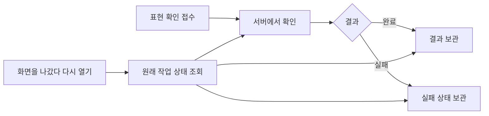

# 표현 확인의 비동기 처리와 UI 조사

조사일: 2026-09-09. 제품 동작과 API 동작을 구분해 공식 문서를 확인하고, Mobbin 수집 화면의 실제 이미지를 살폈다. 수집 화면은 해당 시점의 UI 근거이며 현재 모든 계정의 UI나 백그라운드 동작을 보장하지 않는다. 경쟁 제품에 실제 작업을 제출하거나 앱 종료 실험을 하지는 않았다.

## 이번에 확정한 것

마지막 캐릭터 대사는 바로 보여 주고, 해당 대화의 표현 확인 요청이 성공 또는 실패로 모두 끝나면 축하 연출과 종료 카드, `표현 돌아보기` 버튼을 표시한다. 확인 중에는 기다리되, 실패했을 때는 대화 화면에 기존 실패 안내와 개별 재시도를 남기고 종료를 허용하기로 했다. 표현 확인은 영어 교정과 한국어 입력의 영어 안내를 만드는 작업이며, 사용자가 카드를 읽는 행동을 기다리는 것이 아니다.

사용자는 이후 구현 단순성을 우선해 **화면 밖의 지속 실행은 제외하고, 돌아오면 완료 결과가 없는 메시지만 자동으로 다시 확인하는 방식**을 선택했다. 교정할 필요가 없는 결과도 완료로 남기고, 완료된 결과는 재사용한다. 2026-09-10에는 표현 돌아보기에서 실패한 메시지와 개별 재시도를 제외하고 준비된 카드만 보여 주기로 했다. 대화 화면의 기존 실패 안내와 재시도, 재진입 시 미완료 메시지 재확인은 유지하며 같은 화면에서 실패를 무한히 자동 재시도하지 않는다. 현재 계약은 [스펙](spec.md)의 `화면을 나갔다 돌아오기`와 `대화 화면의 표현 확인 실패와 재시도` 절이 소유한다. 아래의 지속 실행안은 당시의 비교 자료다.

## 제품에서 확인한 동작

| 사례 | 공식 문서에서 확인한 동작 | 적용할 수 있는 원칙 |
| --- | --- | --- |
| ChatGPT Deep Research | 진행 과정을 확인하고 중간에 방향을 조정할 수 있다. 결과와 활동 이력은 해당 대화에 남는다. 출시 소개는 다른 일을 하는 동안 진행하고 완료 알림을 받는 흐름을 설명한다. | 작업을 시작한 대화가 진행 상황과 결과를 다시 찾는 자리다. |
| ChatGPT Work의 cloud browser | 대화를 떠나거나 기기를 꺼도 원격 작업을 계속한다. 입력, 로그인, 확인이 필요하면 기다린다. | 화면을 떠나는 행동과 작업을 취소하는 행동을 구분한다. |
| Claude Cowork의 클라우드 세션 | 기기를 닫아도 작업을 이어가며 다른 기기에서 같은 세션을 열 수 있다. 완료되거나 사용자 입력이 필요하면 휴대전화로 알린다. 로컬 파일·기기 조작에는 해당 데스크톱 앱의 연결이 필요하다. | 실행 중·사용자 조치 필요·완료 상태를 같은 작업에 연결한다. |

근거: [ChatGPT Deep Research 도움말](https://help.openai.com/en/articles/10500283-deep-research-faq), [2025년 Deep Research 출시 소개](https://openai.com/index/introducing-deep-research/), [ChatGPT cloud browser](https://help.openai.com/en/articles/20001280-using-cloud-browser-in-chatgpt), [Claude Cowork 기기 간 사용](https://support.claude.com/en/articles/15520349-use-claude-cowork-on-web-desktop-and-mobile).

이 사례를 일반 채팅의 모든 응답에 그대로 일반화하지 않는다. [Claude Research 도움말](https://support.claude.com/en/articles/11088861-use-research-on-claude)은 검색 동작을 설명하지만 앱 종료 후의 실행·복구를 구체적으로 보장하지 않으므로, 그 근거로 Cowork와 같은 수명을 주장하지 않는다.

## 화면에서 직접 확인한 것

| 수집 화면 | 실제로 보이는 UI | 플린에 적용할 점 |
| --- | --- | --- |
| [ChatGPT 리서치 진행](https://mobbin.com/screens/b045e2cd-4f54-424a-97f6-4c5954f0c1e1) | 대화 안의 작은 작업 카드에 현재 단계와 출처 수, 진행 표시, 중지 컨트롤이 있다. 오른쪽에는 Activity와 Sources 패널이 열려 있고, 입력창 위에는 기다리는 동안 다른 질문을 할 수 있다는 안내가 있다. | 진행 요약과 상세 내역의 정보량을 나눈다. 기다리는 동안 대화 내용을 읽을 수 있다. |
| [ChatGPT 리서치 결과](https://mobbin.com/screens/1d43b453-a7b4-438f-8038-f9d5c16c903e) | 같은 대화에 보고서가 보이고 오른쪽 패널에는 작업 내역과 완료 상태가 남는다. | 완료 뒤 결과를 지속적으로 찾을 수 있게 한다. |
| [Claude 모바일 답변 대기](https://mobbin.com/screens/34fe8a95-5a3a-4ec3-83fa-82e68afcf57f) | 사용자 메시지 아래 답변 위치에 작은 Claude 표시가 있고, 입력창 안에 중지 버튼이 보인다. | 진행 표시는 작업이 일어나는 위치에 둔다. 정지 이미지로 애니메이션 방식이나 지속 시간을 추정하지 않는다. |
| [Claude 모바일 응답 알림 안내](https://mobbin.com/screens/795e1600-cad6-4f17-ab49-2dde0f004836) | 대화 안에 응답 알림을 켜는 카드가 있고, 자리를 비워도 답변이 오면 알려준다고 설명한다. 답변 대기 표시와 중지 버튼은 유지된다. | 화면을 떠나도 된다는 안내에는 나중에 결과를 알아볼 수단이 함께 있어야 한다. 이 화면만으로 모든 앱 종료·네트워크 상황을 보장하지 않는다. |

응답 생성 실패의 정확한 수집 화면은 확보하지 못했다. 검색에 섞여 나온 다른 앱이나 이메일 변경 오류를 ChatGPT·Claude의 응답 실패 사례로 쓰지 않았다. 재시도 UI 제안은 플린의 기존 교정 계약에 근거한다.

## UI 지침에서 얻은 것

- 진행률을 알 수 없을 때는 정확하지 않은 퍼센트를 만들지 않는다. 무엇을 처리하는지 짧게 설명하고, 진행 표시를 일관된 자리에 둔다. 멈춘 작업을 계속 진행 중처럼 표시하지 않는다. [Apple 진행 표시 지침](https://developer.apple.com/design/human-interface-guidelines/progress-indicators)
- 긴 작업에서는 사용자가 다른 일을 할 수 있게 하고, 돌아왔을 때 이전 작업과 결과를 쉽게 찾도록 한다. 시간을 추정하기 어렵다면 실제 완료 단계로 진행 상황을 설명할 수 있다. [NN/g의 긴 대기와 중단 연구](https://www.nngroup.com/articles/designing-for-waits-and-interruptions/)
- 위 NN/g 글은 장시간의 복잡한 업무 도구를 다룬다. 성공 모달이나 상세 작업 로그를 플린의 짧은 표현 확인에 그대로 도입할 근거로 쓰지 않는다. Apple의 macOS 전용 배치 조언도 iOS 규칙으로 옮기지 않는다.

## 기술적으로 필요한 차이

서버가 접수한 작업을 화면의 연결과 별개로 실행하고, 앱은 같은 작업의 상태와 결과를 다시 조회하는 방식이 이탈에 강하다. 단순히 요청을 비동기로 호출하거나 로딩 표시를 추가하는 것만으로는 이 성질을 얻지 못한다.

- OpenAI Responses API의 background mode는 작업 식별자로 진행 상태를 조회하고 명시적으로 취소할 수 있다. 스트림 연결이 끊긴 뒤 같은 응답의 이벤트를 이어 받는 방식도 문서화돼 있다. 이는 API 기능의 근거이며 ChatGPT 내부 구현의 근거는 아니다. 보관 정책이 따로 있으므로 앱의 장기 기록 저장을 공급자 응답 보관에 맡긴다고 가정하지 않는다. [OpenAI background mode](https://developers.openai.com/api/docs/guides/background)
- 비동기 요청·응답 패턴은 작업 접수, 상태 조회, 결과 조회를 구분한다. 중복 접수에는 같은 작업을 반환해 네트워크 재시도로 작업이 겹치지 않게 한다. 실행 중과 실패도 별도 상태로 남긴다. [Microsoft 비동기 요청·응답 패턴](https://learn.microsoft.com/en-us/azure/architecture/patterns/asynchronous-request-reply)
- 연결이 끊겨 응답을 받지 못한 것과 서버 작업이 실패한 것은 다르다. 다시 들어왔을 때 먼저 원래 작업 상태를 확인해야 한다는 것이 위 자료로부터의 설계 제안이다.
- 어떤 작업 실행 서비스나 모델 공급자 기능을 사용할지는 결정하지 않았다. 이 조사에서는 의존성이나 인프라를 추가하지 않는다.

## 현재 플린 코드에서 확인한 차이

기준: `9fe28fe`의 소스. 런타임 재현은 하지 않았다.

- [모바일 표현 상태](../../../apps/mobile/src/features/episode/state/episode-corrections.tsx)는 진행 중·실패·자연스러운 표현 등의 상태를 메모리에 둔다. 해당 훅이 해제되면 진행 중인 요청을 abort하고 타이머를 지운다. 화면 전환마다 반드시 해제된다는 뜻은 아니지만, 화면이 사라져도 작업을 이어가는 보장은 없다.
- [표현 확인 API](../../../apps/api/src/features/episode/route.ts)는 요청의 취소 신호와 30초 제한을 표현 판정에 전달한다. 교정 결과가 있는 경우 저장을 시도하며, 별도 작업의 접수·진행·실패 상태를 조회하는 흐름은 아니다.
- 따라서 제안을 채택하면 앱이 다시 열렸을 때 미완료·완료·실패를 구분할 수 있도록 작업 수명과 기록도 바꿔야 한다. `자연스러운 표현`처럼 카드가 없는 완료 결과도 구분해야 하며, 기존 교정 행이 없다는 사실을 미완료의 증거로 쓰면 안 된다.
- 메시지별 실패 문구와 재시도는 이미 [모바일 대화 중 교정](../../decisions/mobile-episode-correction.md)에 정해져 있다. 해당 메시지의 확인만 다시 하고, 사용자 메시지나 캐릭터 답변은 다시 만들지 않는다.

## 비교한 지속 실행안 — 이번 범위에서 제외

최초 후보는 **화면을 떠나도 서버가 이미 접수한 표현 확인을 계속하고, 돌아오면 같은 대화에서 최신 상태를 보여 주는 방식**이었다. 사용자는 아래의 구현 범위 비교 후 더 작은 재진입 방식을 선택했다. 이 절의 표와 미정 표기는 당시의 후보를 보존한 것이며 현재 요구사항은 아니다.

그림에서 상태 조회는 실행 중인 원래 작업을 다시 관찰하는 뜻이며 새 작업을 생성하는 뜻이 아니다.

| 상황 | UI 후보 | 판단 이유 |
| --- | --- | --- |
| 대화 중 확인 | 기존처럼 해당 메시지 아래에 `표현을 확인하고 있어요.`와 작은 진행 표시 | 어떤 문장을 확인하는지 연결한다. |
| 마지막 대사 뒤 남은 확인 | 마지막 대사와 준비된 안내를 유지한다. 입력창이 있던 하단에 짧은 진행 요약을 보여 준다. | 기다리는 이유를 보이면서 마지막 대사를 읽게 한다. 종료 카드 표시 순서는 이미 합의했다. 대기 영역의 구체적인 모양은 제안이다. |
| 화면을 나감 | 이동을 허용하고, 기존 이어하기나 기록 항목에 `표현 확인 중` 같은 상태를 붙인다. | 별도 작업함을 추가하지 않고 돌아올 자리를 만든다. 정확한 노출 위치와 문구는 미정이다. |
| 확인 완료 | 그 대화를 보고 있다면 합의한 축하·결말 카드로 전환한다. 다른 화면을 보고 있다면 강제로 이동시키지 않고 같은 기록에 결과를 준비한다. | 다음 행동을 사용자가 선택하도록 한다. 재방문의 축하 반복 금지 규칙은 유지한다. |
| 일시적 실패 | 서버가 횟수와 시간을 제한해 재시도하는 방향을 제안한다. | 사용자에게 일시적 장애를 처리하는 일을 바로 넘기지 않는다. 횟수·시간은 아직 미정이다. |
| 재시도 후에도 실패 | 무한 진행 표시를 끝내고 기존 메시지별 실패 문구와 재시도 아이콘을 쓴다. 대화와 다른 표현은 유지하고 이동은 허용한다. | 실패를 교정할 내용 없음이나 성공으로 위장하지 않는다. 이 상태에서 종료를 계속 보류하는 정책은 추가 합의가 필요하다. |

완료 푸시는 긴 독립 작업의 사례에서 확인했지만, 매 메시지의 짧은 표현 확인에 그대로 도입하는 것은 권하지 않는다. 우선 해당 에피소드의 지속적인 상태 표시와 재진입을 설계하고, 실제 대기 시간과 사용자의 재방문 문제를 확인한 뒤 알림 필요성을 판단할 수 있다. 이는 이번 조사의 제안이며 승인된 알림 정책은 아니다.

지속 실행안은 이번 범위에서 제외했다. 이후 사용자는 확인 중에만 종료 카드를 기다리고, 실패로 끝나면 종료를 허용하는 방식을 선택했다. 대화 화면의 기존 메시지별 재시도는 유지한다. 표현 돌아보기는 준비된 카드만 표시하며 카드가 없으면 빈 상태를 보여 준다. 이 필터가 메시지의 실패 판정을 확인 완료로 바꾸지는 않는다. 대기·실패·재시도·재진입 전환은 프로토타입의 가상 타이머로 재현한다.

## 구현 단순성을 우선한 추가 검토

사용자는 화면을 나가도 계속하는 기능이 쉽게 구현되지 않으면 원하지 않는다고 했다. 아래 평가는 현재 코드와 배포 계약을 확인한 상대적인 작업 범위 판단이며, 구현 실험이나 소요 시간 측정 결과는 아니다.

| 범위 | 필요한 변경 | 판단 |
| --- | --- | --- |
| 앱이 켜진 채 다른 화면으로 이동해도 계속 | 표현 작업의 상태와 요청을 개별 화면보다 오래 유지하고, 여러 에피소드 및 재진입과 연결 | 서버 작업 체계보다 범위는 작지만, 화면 해제 시 취소 한 줄만 지우는 것으로 끝나지 않는다. 앱 종료까지 보장하지 않는다. |
| 앱을 닫아도 서버에서 계속 | 요청 연결과 별개인 서버 실행, 진행·완료·실패 상태 보관, 재조회와 중복 실행 방지 | 기존 API와 앱 상태 관리 양쪽을 바꾸는 별도 기능이다. 단순한 화면 변경으로 보기는 어렵다. |
| 돌아왔을 때 미완료 메시지를 다시 확인 | 완료 여부 보관과 재진입 시 기존 표현 확인 API 호출 | 상대적으로 작은 대안이다. 이미 완료된 결과를 유지하고, 중단된 문장만 다시 확인한다. 완료 판정과 중복 요청 처리는 여전히 필요하다. |

서버는 [AI 서버 경계](../../decisions/ai-server-boundary.md)에 따라 Vercel Functions에 배포한다. Vercel의 `waitUntil`은 응답 뒤에도 짧은 작업을 이어갈 수 있어 별도 작업 큐가 반드시 필요한 것은 아니다. 다만 함수 실행 제한에 묶이며 상태 보관·재조회·재시도를 자동으로 해결하지 않는다. [Vercel 공식 API 문서](https://vercel.com/docs/functions/functions-api-reference/vercel-functions-package)

사용자는 이번 범위에서 화면 밖의 지속 실행을 보장하는 기능을 넣지 않고, 돌아왔을 때 완료되지 않은 메시지만 자동으로 다시 확인하는 방식을 선택했다. `자연스러운 표현`도 완료로 남겨 반복 검사하지 않는다. 마지막 대사를 다시 생성하거나 사용자의 메시지를 다시 보내지 않는다. 결과와 완료 여부를 함께 남기고 중복 요청을 막는 보완은 이 작은 대안에도 필요하다.
