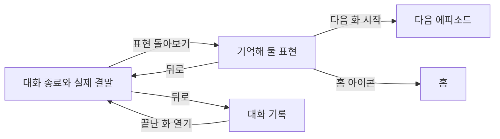

# 에피소드 종료와 표현 돌아보기

상태: 검토 중인 초안. 2026-09-09까지 사용자가 확인한 내용부터 기록한다.
아래의 미정 사항은 승인된 동작이 아니다. 이 문서만으로 전체 구현 준비가 끝났다고 보지 않는다.

[현재 프로토타입](prototype.html)은 가상 대화로 화면과 이동을 확인하는 초안이다.

## 사용자가 얻는 것

- 대화가 어떤 결과로 끝났는지 이해하고, 영어로 대화를 이어간 성취감을 느낀다.
- 이번 대화에서 안내받은 영어 표현과 뜻을 다시 보고, 다른 상황에서 쓸 예문을 확인한다.
- 다음 화를 시작하거나 홈으로 이동한다. 나중에 대화 기록에서도 같은 화의 표현을 다시 본다.

## 확인한 범위와 동작

### 대화의 종료

- 마지막 캐릭터 대사와 지문은 표현 확인을 기다리지 않고 보여 준다. 해당 대화의 모든 사용자 메시지에 대한 표현 확인이 끝나면 입력창 자리에 축하 연출, 실제 결말 카드와 `표현 돌아보기` 버튼을 함께 표시한다. 사용자가 2026-09-09에 이 표시 순서에 동의했다.
- 여기서 표현 확인은 영어 메시지의 교정 또는 한국어 메시지의 영어 안내를 만드는 작업이다. 사용자가 안내를 읽거나 카드를 펼치는 행동을 기다린다는 뜻이 아니다. `자연스러운 표현이에요.`처럼 교정할 필요가 없다고 확인된 메시지도 완료에 포함한다.
- 사용자가 버튼을 눌러 다음 화면으로 이동한다. 마지막 대화를 읽는 도중 자동으로 이동하지 않는다.
- 상황 줄은 종료 뒤에도 유지한다.
- 모든 결말에 짧은 축하 연출을 보여 준다. 목표를 달성했을 때는 `해냈어요!`와 실제 결과를 표시한다.
- 목표를 그대로 이루지 못한 결말은 실제 결과를 표시한다. `해냈어요!`나 `한 장면을 마쳤어요!`로 대신하지 않는다.
- 연출은 종료 시 한 번만 재생한다. 뒤로 돌아오거나 기록을 다시 볼 때 반복하지 않는다. 연출 중에도 버튼을 누를 수 있다.
- 시스템의 동작 줄이기를 사용하면 정지된 완료 표시로 전달한다.
- 사용자가 대화를 저장하는 별도 단계, 저장 버튼, 완료 저장 실패 화면을 두지 않는다. 사용자는 대화하고 앱과 서버가 기록한다.

### 표현 돌아보기

- 화면 제목은 `표현 돌아보기`, 목록 제목은 `기억해 둘 표현`이다.
- 영어 교정과 한국어 입력에 대한 영어 안내를 한 목록에서 보여 준다. `안 본 표현` 표시나 읽었는지에 따른 구분을 두지 않는다.
- 카드에는 쓰는 상황, 영어 표현, 한국어 뜻을 보여 준다. 카드를 펼치면 내가 쓴 문장, 설명, 다른 예문과 그 뜻이 보인다.
- 상단에 스토리와 해당 화를 표시한다. 다른 회차나 다른 화의 표현을 섞지 않는다.
- 왼쪽 뒤로 가기는 표현 화면을 열었던 대화로 돌아간다. `대화 다시 보기` 버튼을 목록 안에 중복해서 두지 않는다.
- 오른쪽 홈 아이콘으로 홈에 이동한다. 접근성 이름은 `홈으로 이동`이다. `오늘은 여기까지` 버튼은 두지 않는다.
- 목록을 불러오지 못하면 헤더와 이동 수단을 유지하고, 기존 목록 조회 오류 형태와 `다시 시도하기` 버튼을 사용한다. 별도 오류 카드를 새로 만들지 않는다.

### 다음 이야기와 마지막 화

- 다음 이야기 예고는 현재 시안처럼 하단의 시작 버튼 위에 고정한다. 다음 화 번호, 제목과 짧은 예고를 함께 보여 준다.
- 마지막 화에서는 `마지막 이야기까지 함께했어요`와 `대화 기록 보기`를 보여 준다. 홈 아이콘과 뒤로 가기도 유지한다.
- 첫 화와 마지막 화의 문장 비교는 이번 작업에 포함하지 않는다. 사용자는 현재 마지막 화 화면을 선택했다.

### 카드 내용의 생성과 저장

- 사용자가 대화 중 표현을 확인할 때 카드에 필요한 내용도 함께 만들고 저장하는 방향을 확인했다.
- 기존 원문, 고친 영어 문장과 설명에 쓰는 상황 한 줄, 전체 영어 문장의 한국어 뜻 한 줄, 다른 예문 한 개와 그 뜻을 추가한다.
- 추가 내용은 같은 사용자 메시지의 표현에 연결한다. 사용자가 별도로 등록하거나 저장하지 않는다.
- 표현 돌아보기는 이미 준비한 내용을 읽어 보여 준다. 화면을 열 때마다 같은 카드 내용을 새로 만들지 않으며, 기록에서 다시 열어도 저장된 내용을 사용한다.
- 대화 중 표현 안내는 준비되는 대로 보여 준다. 마지막 대사 뒤에는 아직 확인 중인 메시지의 결과를 기다렸다가 종료 카드와 `표현 돌아보기` 버튼을 표시한다. 이미 준비된 표현 안내는 기다리는 동안에도 읽을 수 있다.
- 확인 중인 표현이 남아 있으면 확정된 빈 결과처럼 안내하지 않는다. 마지막 메시지만 늦는다고 가정하지 않는다.

### 화면을 나갔다 돌아오기

- 구현 단순성을 우선해 화면을 떠난 뒤 표현 확인을 계속 실행하는 기능은 이번 범위에서 제외한다. 기다리는 동안 화면을 나갈 수 있으며, 앱을 닫은 동안 확인이 끝난다고 약속하지 않는다.
- 사용자 메시지마다 표현 확인의 완료 여부와 결과를 남긴다. 교정이나 한국어 입력의 영어 안내뿐 아니라 `자연스러운 표현이에요.`처럼 교정할 필요가 없다는 결과도 완료로 남긴다. 표현 카드가 없다는 이유만으로 미완료로 판단하지 않는다.
- 같은 에피소드에 돌아오면 서버에 남은 결과를 먼저 읽는다. 완료된 메시지의 결과는 그대로 사용하고, 완료 결과가 없는 메시지만 자동으로 다시 확인한다. 사용자가 별도로 재개 버튼을 누를 필요가 없다.
- 중단된 메시지의 표현 확인은 처음부터 다시 수행한다. 사용자 메시지를 다시 보내거나 캐릭터의 마지막 대사를 다시 만들거나 대화를 처음부터 시작하지 않는다.
- 결과와 완료 여부는 함께 유지한다. 완료로 표시됐는데 필요한 표현 내용이 없는 상태를 만들지 않는다. 이전 요청과 재진입의 요청이 겹쳐도 같은 메시지의 결과가 중복 생성되거나 서로 덮어쓰지 않게 한다.
- 마지막 대사가 이미 있는 화에 돌아왔어도, 미완료 메시지의 확인이 끝날 때까지 종료 카드와 `표현 돌아보기` 버튼을 기다린다. 그동안 기존 대화와 완료된 표현 안내는 읽을 수 있다. 기록을 통한 재진입에도 같은 기준을 적용한다.
- 재진입 뒤 다시 확인한 요청도 실패할 수 있다. 실패를 확인 완료로 바꾸거나 무한히 자동 재시도하지 않는다. 같은 화면에서 실패한 뒤의 재시도와 종료 보류 정책은 아래의 미정 사항에서 정한다.

### 기록에서 다시 보기

- 사용자가 2026-09-09에 대화 기록에서 표현을 다시 여는 동선을 확인했다.
- 대화 기록에서 끝난 화를 열면 에피소드 종료 때와 같은 화면을 사용한다. 상황 줄, 대화와 그 곁의 표현 안내, 실제 결말 카드와 `표현 돌아보기` 버튼을 같은 형태로 보여 준다.
- 별도의 `끝` 표시나 결말 문구만 있는 기록용 화면을 두지 않는다. 같은 종료 화면의 `표현 돌아보기`로 그 화의 표현을 다시 볼 수 있다.
- 뒤로 가기를 누르면 방금 보던 끝난 화의 대화로 돌아간다. 다시 뒤로 가면 해당 대화 기록으로 돌아간다.
- 열어보기만 해도 새 회차가 생기거나 대화가 다시 시작되거나 기존 결말이 바뀌지 않는다.
- 기록에서 다시 열거나 표현 화면에서 뒤로 돌아올 때 축하 애니메이션을 다시 재생하지 않는다. 완료 표시는 정지된 상태로 유지한다.

## 아직 정하지 않은 내용

종료 표시 순서와 재진입 처리는 확인했다. 남은 주제는 표현 확인에 실패했을 때의 처리다.

- 같은 화면에서 일부 표현 확인이 실패한 경우의 재시도와 종료 보류, 판정할 수 없는 입력의 처리를 정한다. 재진입 때 미완료 메시지를 자동으로 다시 확인한다는 결정이 같은 화면에서 무한히 자동 재시도한다는 뜻은 아니다.
- 현재 시안의 `마지막 메시지의 표현을 확인하고 있어요.`와 빈 결과를 함께 표시하는 모양은 확정안이 아니다. 표현 확인 완료와 종료 사이의 전환도 아직 시안에서 검증하지 않았다.

[비동기 처리와 UI 조사](async-work-research.md)에 공식 문서, 수집 화면과 비교한 대안을 기록했다. 현재 선택은 위의 재진입 처리이며, 조사 문서에 남은 다른 UI 후보는 승인된 요구사항이 아니다.

## 바꿀 수 있는 시안의 기본값

- 현재 시안과 기존 조회 방식에 맞춰 사용자 메시지 하나를 카드 하나로 묶고 대화 순서로 보여 주는 것을 기본값으로 삼는다. 한 문장 안의 수정 사항은 같은 카드에 모으며, 서로 다른 메시지에서 반복된 표현도 해당 문맥과 함께 유지한다. 이는 확정된 별도 제품 결정이 아니며 여러 표현이 있는 카드의 모양은 검토할 수 있다.
- 기록에서 다시 연 표현 화면도 같은 카드와 제목을 사용한다. 다음 화가 이미 끝났으면 `N화 다시 보기`로 표시하며 기존 결말이 있는 대화를 연다. 재진입 시 다음 이야기 영역의 상세 구성은 검토할 수 있다.
- 현재 축하 연출은 파란 완료 표시, 작은 반짝임과 약 1초의 흩어지는 조각으로 구성한다. 실제 기기에서 속도와 크기를 조정할 수 있다.
- 가상의 5개 에피소드와 카드 수는 화면 검토용이다. 실제 에피소드 수, 표현 수나 추출 규칙을 정하지 않는다.

## 확인할 완료 기준

- 마지막 대화를 읽고 직접 표현 화면으로 이동할 수 있다. 뒤로 돌아와도 결말이 유지된다.
- 성공과 다른 결말에서 해당 결과를 정확히 보여 주며 축하 연출이 재방문마다 반복되지 않는다.
- 표현 카드를 펼치고 접어 원문과 예문을 볼 수 있다. 읽었는지에 따라 카드가 다른 목록으로 이동하지 않는다.
- 새로 준비한 카드에 쓰는 상황, 한국어 뜻, 다른 예문과 그 뜻이 함께 남고, 같은 기록을 다시 열어도 유지된다.
- 교정이 있는 메시지와 자연스럽다고 확인된 메시지는 다시 들어와도 재검사하지 않는다. 확인 도중 나간 뒤 같은 화를 다시 열면 완료 결과가 없는 메시지만 자동으로 다시 확인한다.
- 재진입 시 사용자 메시지, 캐릭터 대사, 표현 카드가 중복되지 않는다. 필요한 표현 결과가 준비되기 전에 확인 완료로 표시하지 않는다.
- 대화 중에는 먼저 준비된 표현 안내를 볼 수 있다. 마지막 대사가 도착했어도 확인 중인 메시지가 남으면 축하 연출, 종료 카드와 `표현 돌아보기` 버튼을 아직 표시하지 않는다. 모든 메시지의 확인이 끝나면 함께 표시한다. 확인 중인 항목을 확정된 빈 결과로 표시하지 않는다.
- 홈 아이콘과 뒤로 가기로 각 목적지에 이동한다. 같은 동작의 버튼을 본문에 중복하지 않는다.
- 대화 기록에서 특정 회차의 특정 화를 열고, 그 화의 표현을 확인한 뒤 같은 대화와 기록으로 돌아온다.
- 대화 기록에서 연 종료 화면은 종료 직후 화면과 같은 결말 카드와 표현 안내를 보여 준다. 입력창은 없고, 기록을 다시 여는 것만으로 축하 애니메이션이 재생되지 않는다.
- 다음 화로 이동하거나 기록을 다시 보는 것만으로 끝난 화를 다시 시작하지 않는다.
- 마지막 화에서도 빈 목록과 조회 오류 등 관련 상태를 검토할 수 있고, 없는 다음 화를 시작하는 버튼이 나타나지 않는다.
- 다음 화 예고는 시작 버튼 위에 고정되어 있고, 마지막 화에서는 현재 시안의 완료 안내와 대화 기록 이동을 제공한다.
- 좁은 화면, 큰 시스템 글자, 밝은 화면과 어두운 화면에서 내용과 버튼에 접근할 수 있다. 실제 Expo 화면은 별도로 기기에서 확인한다.
- 표현 확인 실패 후의 재시도와 종료 보류 기준은 위 미정 사항을 정한 뒤 추가한다. 합의한 종료 표시 순서와 재진입 시 미완료 메시지의 확인도 프로토타입에서 전환을 확인해야 한다.

## 경계와 기존 문서와의 관계

- 홈 전체 구성, 일반 표현 보관함, 점수와 연속 학습 기록은 이번 화면 변경에 포함하지 않는다.
- 기존 사용자 기록이 없는 신규 프로젝트다. 예전 교정 기록의 호환이나 추가 정보 보충은 설계하지 않는다.
- 대화 기록에서 연 종료 화면은 새 메시지를 입력하거나 기존 대화를 바꾸는 동작을 제공하지 않는다. 종료 직후와 같은 표현 안내를 유지하고, 전체 표현 목록은 `표현 돌아보기`에서 확인한다.
- [모바일 대화 중 교정](../../decisions/mobile-episode-correction.md)의 대화 중 카드와 재시도 규칙을 기본으로 삼는다. 이 계약이 다음 단위로 남긴 종료 뒤 표현 화면은 이번 작업이 맡는다. 읽기 전용 복습에서 표현을 표시하지 않던 이전 경계도 같은 종료 화면을 재사용한다는 이번 결정으로 변경한다.
- [모바일 스토리 탐색](../../decisions/mobile-story-browsing.md)의 회차별 기록과 읽기 전용 대화 원칙을 유지한다.
- [제품 정의](../../../PRODUCT.md)의 읽지 않은 표현을 구분하는 설명은 이번에 확인한 한 목록 방식과 다르다. 제거하기로 한 구분을 새 구현의 요구로 되살리지 않는다. 제품 정의의 해당 문장도 별도 정리가 필요하다.
- 현재 HTML은 대화 생성, 실제 목표 판정, 네트워크, 기록의 지속 보관을 검증하지 않는다. 대기 상태는 강제 미리보기이며 실제 요청의 완료 흐름을 검증한 것으로 보지 않는다.
