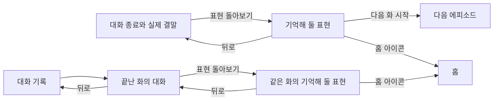

# 에피소드 종료와 표현 돌아보기

상태: 검토 중인 초안. 2026-09-09까지 사용자가 확인한 내용부터 기록한다.
아래의 미정 사항은 승인된 동작이 아니다. 이 문서만으로 전체 구현 준비가 끝났다고 보지 않는다.

[현재 프로토타입](prototype.html)은 가상 대화로 화면과 이동을 확인하는 초안이다.

## 사용자가 얻는 것

- 대화가 어떤 결과로 끝났는지 이해하고, 영어로 대화를 이어간 성취감을 느낀다.
- 이번 대화에서 안내받은 영어 표현과 뜻을 다시 보고, 다른 상황에서 쓸 예문을 확인한다.
- 다음 화를 시작하거나 홈으로 이동한다. 나중에 대화 기록에서도 같은 화의 표현을 다시 본다.

## 확인한 범위와 동작

### 대화의 종료

- 마지막 캐릭터 대사와 지문을 대화에 남긴다. 입력창 자리에 실제 결말과 `표현 돌아보기` 버튼을 표시한다.
- 사용자가 버튼을 눌러 다음 화면으로 이동한다. 마지막 대화를 읽는 도중 자동으로 이동하지 않는다.
- 상황 줄은 종료 뒤에도 유지한다.
- 모든 결말에 짧은 축하 연출을 보여 준다. 목표를 달성했을 때는 `해냈어요!`와 실제 결과를 표시한다.
- 목표를 그대로 이루지 못한 결말은 실제 결과를 표시한다. `해냈어요!`나 `한 장면을 마쳤어요!`로 대신하지 않는다.
- 연출은 종료 시 한 번만 재생한다. 뒤로 돌아오거나 기록을 다시 볼 때 반복하지 않는다. 연출 중에도 버튼을 누를 수 있다.
- 시스템의 동작 줄이기를 사용하면 정지된 완료 표시로 전달한다.
- 사용자가 대화를 저장하는 별도 단계, 저장 버튼, 완료 저장 실패 화면을 두지 않는다. 사용자는 대화하고 앱과 서버가 기록한다.

### 표현 돌아보기

- 화면 제목은 `표현 돌아보기`, 목록 제목은 `기억해 둘 표현`이다.
- 영어 교정과 한국어 입력에 대한 영어 안내를 한 목록에서 보여 준다. `안 본 표현` 표시나 읽었는지에 따른 구분을 두지 않는다.
- 카드에는 쓰는 상황, 영어 표현, 한국어 뜻을 보여 준다. 카드를 펼치면 내가 쓴 문장, 설명, 다른 예문과 그 뜻이 보인다.
- 상단에 스토리와 해당 화를 표시한다. 다른 회차나 다른 화의 표현을 섞지 않는다.
- 왼쪽 뒤로 가기는 표현 화면을 열었던 대화로 돌아간다. `대화 다시 보기` 버튼을 목록 안에 중복해서 두지 않는다.
- 오른쪽 홈 아이콘으로 홈에 이동한다. 접근성 이름은 `홈으로 이동`이다. `오늘은 여기까지` 버튼은 두지 않는다.
- 목록을 불러오지 못하면 헤더와 이동 수단을 유지하고, 기존 목록 조회 오류 형태와 `다시 시도하기` 버튼을 사용한다. 별도 오류 카드를 새로 만들지 않는다.

### 기록에서 다시 보기

- 사용자가 2026-09-09에 대화 기록에서 표현을 다시 여는 동선을 확인했다.
- 대화 기록에서 끝난 화의 대화를 연 뒤 `표현 돌아보기`로 그 화의 표현을 다시 볼 수 있다.
- 뒤로 가기를 누르면 방금 보던 끝난 화의 대화로 돌아간다. 다시 뒤로 가면 해당 대화 기록으로 돌아간다.
- 열어보기만 해도 새 회차가 생기거나 대화가 다시 시작되거나 기존 결말이 바뀌지 않는다.
- 재진입 버튼은 현재 시안에서 끝난 대화의 하단에 둔다. 정확한 배치는 바꿀 수 있는 시안의 기본값이다.

## 아직 정하지 않은 내용

1. **카드 내용을 준비하는 방식과 목록의 단위.** 카드에 어떤 내용을 보여 줄지는 확인했다. 쓰는 상황, 한국어 뜻, 다른 예문을 언제 준비할지와 한 메시지에 표현이 여럿일 때 묶는 방식, 중복과 순서는 아직 정하지 않았다. 현재 교정 결과에 필요한 정보가 모두 있지는 않다. 시안의 문장과 뜻은 가상 예시이며 생성 규칙이 아니다.
2. **늦게 도착하는 표현.** 대화의 결말이 정해진 뒤에도 표현 확인은 끝나지 않을 수 있다. 이미 확인한 카드와 대기 중인 표현을 함께 보여 주는 방식, 전부 대기 중인 경우, 일부 확인 실패와 다시 확인, 화면 이동 뒤의 처리는 아직 논의 중이다. 현재 시안의 `마지막 메시지의 표현을 확인하고 있어요.`는 마지막 메시지만 늦는다는 보장이 없는 임시 안내다. `표현이 없어요`와 확인 중 안내가 함께 나오는 현재 시안은 확정안이 아니다.
3. **다음 이야기의 배치.** 다음 화의 제목과 짧은 예고, 시작 버튼을 보여 주는 방향으로 검토한다. 예고를 하단에 고정할지 표현 목록 끝에 둘지는 아직 선택하지 않았다. 현재는 하단 고정 시안이며, 작은 화면에서 글자가 크면 예고를 따로 스크롤하게 된다.
4. **스토리 전체를 끝낸 뒤의 범위.** 마지막 화에는 다음 화 시작 버튼을 두지 않는다. 현재 시안은 `마지막 이야기까지 함께했어요`와 `대화 기록 보기`를 보여 준다. 첫 화와 마지막 화의 문장을 비교하는 제품 방향을 이 작업에 포함할지는 아직 정하지 않았다.

## 바꿀 수 있는 시안의 기본값

- 기록에서 다시 연 표현 화면도 같은 카드와 제목을 사용한다. 다음 화가 이미 끝났으면 `N화 다시 보기`로 표시하며 기존 결말이 있는 대화를 연다. 재진입 시 다음 이야기 영역의 상세 구성은 검토할 수 있다.
- 현재 축하 연출은 파란 완료 표시, 작은 반짝임과 약 1초의 흩어지는 조각으로 구성한다. 실제 기기에서 속도와 크기를 조정할 수 있다.
- 가상의 5개 에피소드와 카드 수는 화면 검토용이다. 실제 에피소드 수, 표현 수나 추출 규칙을 정하지 않는다.

## 확인할 완료 기준

- 마지막 대화를 읽고 직접 표현 화면으로 이동할 수 있다. 뒤로 돌아와도 결말이 유지된다.
- 성공과 다른 결말에서 해당 결과를 정확히 보여 주며 축하 연출이 재방문마다 반복되지 않는다.
- 표현 카드를 펼치고 접어 원문과 예문을 볼 수 있다. 읽었는지에 따라 카드가 다른 목록으로 이동하지 않는다.
- 홈 아이콘과 뒤로 가기로 각 목적지에 이동한다. 같은 동작의 버튼을 본문에 중복하지 않는다.
- 대화 기록에서 특정 회차의 특정 화를 열고, 그 화의 표현을 확인한 뒤 같은 대화와 기록으로 돌아온다.
- 다음 화로 이동하거나 기록을 다시 보는 것만으로 끝난 화를 다시 시작하지 않는다.
- 마지막 화에서도 빈 목록과 조회 오류 등 관련 상태를 검토할 수 있고, 없는 다음 화를 시작하는 버튼이 나타나지 않는다.
- 좁은 화면, 큰 시스템 글자, 밝은 화면과 어두운 화면에서 내용과 버튼에 접근할 수 있다. 실제 Expo 화면은 별도로 기기에서 확인한다.
- 표현 대기와 일부 실패의 완료 기준은 위 미정 사항을 정한 뒤 추가한다.

## 경계와 기존 문서와의 관계

- 홈 전체 구성, 일반 표현 보관함, 점수와 연속 학습 기록은 이번 화면 변경에 포함하지 않는다.
- 대화 기록 본문은 읽기 전용으로 유지한다. 표현은 별도 `표현 돌아보기`에서 확인하므로 읽기 전용 본문 안에 카드를 넣지 않는다.
- [모바일 대화 중 교정](../../decisions/mobile-episode-correction.md)의 대화 중 카드와 재시도 규칙을 기본으로 삼는다. 에피소드 종료 뒤 표현 화면을 다음 단위에서 설계한다는 경계는 이번 작업이 맡는다.
- [모바일 스토리 탐색](../../decisions/mobile-story-browsing.md)의 회차별 기록과 읽기 전용 대화 원칙을 유지한다.
- [제품 정의](../../../PRODUCT.md)의 읽지 않은 표현을 구분하는 설명은 이번에 확인한 한 목록 방식과 다르다. 제거하기로 한 구분을 새 구현의 요구로 되살리지 않는다. 제품 정의의 해당 문장도 별도 정리가 필요하다.
- 현재 HTML은 대화 생성, 실제 목표 판정, 네트워크, 기록의 지속 보관을 검증하지 않는다. 대기 상태는 강제 미리보기이며 실제 요청의 완료 흐름을 검증한 것으로 보지 않는다.
