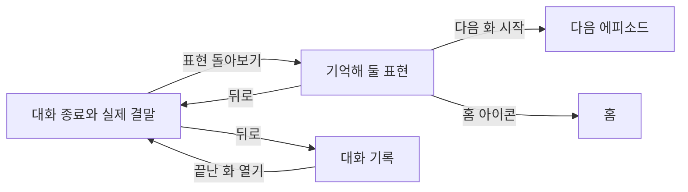

# 에피소드 종료와 표현 돌아보기

상태: 구현과 iOS·Android 검증 완료. 전체 구현의 최종 코드 리뷰를 마쳤으며 필수 수정 사항은 없었다. 2026-09-10까지 확인한 결정과 시안의 기본값을 기록한다.

[현재 프로토타입](prototype.html)은 가상 대화와 타이머로 화면과 이동을 확인한다. 실제 앱과 서버의 구현은 별도 작업이다.

## 사용자가 얻는 것

- 대화가 어떤 결과로 끝났는지 이해하고, 영어로 대화를 이어간 성취감을 느낀다.
- 이번 대화에서 안내받은 영어 표현과 뜻을 다시 보고, 다른 상황에서 쓸 예문을 확인한다.
- 다음 화를 시작하거나 홈으로 이동한다. 나중에 대화 기록에서도 같은 화의 표현을 다시 본다.

## 확인한 범위와 동작

### 대화의 종료

- 마지막 캐릭터 대사와 지문은 표현 확인을 기다리지 않고 보여 준다. 해당 대화의 사용자 메시지 중 확인 중인 항목이 없으면 입력창 자리에 축하 연출, 실제 결말 카드와 `표현 돌아보기` 버튼을 함께 표시한다. 사용자가 2026-09-09에 대기 순서와 실패 시 종료를 허용하는 예외에 동의했다.
- 여기서 표현 확인은 영어 메시지의 교정 또는 한국어 메시지의 영어 안내를 만드는 작업이다. 사용자가 안내를 읽거나 카드를 펼치는 행동을 기다린다는 뜻이 아니다. `자연스러운 표현이에요.`처럼 교정할 필요가 없다고 확인된 메시지도 완료에 포함한다.
- 요청이 실패하면 진행 표시를 끝내고 대화 화면의 해당 메시지에 실패 안내와 재시도를 남긴다. 다른 요청이 모두 끝났다면 종료 카드를 표시한다. 실패한 메시지를 확인 완료나 자연스러운 표현으로 처리한다는 뜻은 아니다.
- 사용자가 버튼을 눌러 다음 화면으로 이동한다. 마지막 대화를 읽는 도중 자동으로 이동하지 않는다.
- 상황 줄은 종료 뒤에도 유지한다.
- 모든 결말에 짧은 축하 연출을 보여 준다. 목표를 달성했을 때는 `해냈어요!`와 실제 결과를 표시한다.
- 목표를 그대로 이루지 못한 결말은 실제 결과를 표시한다. `해냈어요!`나 `한 장면을 마쳤어요!`로 대신하지 않는다.
- 연출은 종료 시 한 번만 재생한다. 뒤로 돌아오거나 기록을 다시 볼 때 반복하지 않는다. 연출 중에도 버튼을 누를 수 있다.
- 시스템의 동작 줄이기를 사용하면 정지된 완료 표시로 전달한다.
- 사용자가 대화를 저장하는 별도 단계, 저장 버튼, 완료 저장 실패 화면을 두지 않는다. 사용자는 대화하고 앱과 서버가 기록한다.

### 표현 돌아보기

- 화면 제목은 `표현 돌아보기`, 준비된 표현 카드의 목록 제목은 `기억해 둘 표현`이다. 이 제목과 개수는 카드가 있을 때만 표시하며, 개수에는 표현 카드만 포함한다.
- 영어 교정과 한국어 입력에 대한 영어 안내를 한 목록에서 보여 준다. `안 본 표현` 표시나 읽었는지에 따른 구분을 두지 않는다.
- 카드에는 쓰는 상황, 영어 표현, 한국어 뜻을 보여 준다. 카드를 펼치면 내가 쓴 문장, 설명, 다른 예문과 그 뜻이 보인다.
- 상단에 스토리와 해당 화를 표시한다. 다른 회차나 다른 화의 표현을 섞지 않는다.
- 왼쪽 뒤로 가기는 표현 화면을 열었던 대화로 돌아간다. `대화 다시 보기` 버튼을 목록 안에 중복해서 두지 않는다.
- 오른쪽 홈 아이콘으로 홈에 이동한다. 접근성 이름은 `홈으로 이동`이다. `오늘은 여기까지` 버튼은 두지 않는다.
- 저장된 목록을 처음 불러올 때는 기존 진행 표시를 본문에 보여 준다. 표현 카드의 목록 제목과 개수, 빈 상태 안내는 아직 표시하지 않는다. 이는 대화 화면에서 기다리는 첨삭 작업과 별개다.
- 목록을 불러오지 못하면 헤더와 이동 수단을 유지하고, 기존 목록 조회 오류 형태와 `다시 시도하기` 버튼을 사용한다. 표현 카드의 목록 제목과 개수는 숨기며 별도 오류 카드를 새로 만들지 않는다. 재조회 중에는 오류 안내를 유지하고 버튼에 진행 표시를 보여 주며 중복 누름을 막는다.
- 2026-09-10 사용자의 결정에 따라 준비된 교정·영어 안내 카드만 보여 준다. 확인에 실패했거나 아직 카드가 준비되지 않은 항목은 필터링한다. 실패한 원문, 오류 안내, 개별 재시도와 `다시 확인할 문장` 영역은 표현 돌아보기에 표시하지 않는다.
- 목록을 읽은 뒤 표시할 카드가 없으면 기존 빈 상태 안내만 보여 준다. 모든 메시지의 확인이 실패한 경우에도 같은 기준을 적용하고, 표현 카드의 목록 제목과 `0개`는 표시하지 않는다. 이 안내는 준비된 카드가 없다는 뜻이며, 실패한 메시지를 확인 완료로 바꾸거나 모든 문장이 자연스럽다고 판정하는 뜻이 아니다.
- 목록 조회 중에도 뒤로 가기, 홈과 하단 이동 버튼을 사용할 수 있다. 재조회 결과가 도착해도 사용자가 이동한 다른 화면이나 화의 내용이 바뀌지 않는다.

### 다음 이야기와 마지막 화

- 다음 이야기 예고는 현재 시안처럼 하단의 시작 버튼 위에 고정한다. 다음 화 번호, 제목과 짧은 예고를 함께 보여 준다.
- 마지막 화에서는 `마지막 이야기까지 함께했어요`와 `대화 기록 보기`를 보여 준다. 홈 아이콘과 뒤로 가기도 유지한다.
- 첫 화와 마지막 화의 문장 비교는 이번 작업에 포함하지 않는다. 사용자는 현재 마지막 화 화면을 선택했다.

### 카드 내용의 생성과 저장

- 사용자가 대화 중 표현을 확인할 때 카드에 필요한 내용도 함께 만들고 저장하는 방향을 확인했다.
- 기존 원문, 고친 영어 문장과 설명에 쓰는 상황 한 줄, 전체 영어 문장의 한국어 뜻 한 줄, 다른 예문 한 개와 그 뜻을 추가한다.
- 추가 내용은 같은 사용자 메시지의 표현에 연결한다. 사용자가 별도로 등록하거나 저장하지 않는다.
- 표현 돌아보기는 이미 준비한 내용을 읽어 보여 준다. 화면을 열 때마다 같은 카드 내용을 새로 만들지 않으며, 기록에서 다시 열어도 저장된 내용을 사용한다.
- 대화 중 표현 안내는 준비되는 대로 보여 준다. 마지막 대사 뒤에는 아직 확인 중인 메시지의 요청이 끝나기를 기다렸다가 종료 카드와 `표현 돌아보기` 버튼을 표시한다. 실패로 끝난 요청에는 아래의 실패 처리 규칙을 적용한다. 이미 준비된 표현 안내는 기다리는 동안에도 읽을 수 있다.
- 확인 중인 표현이 남아 있으면 확정된 빈 결과처럼 안내하지 않는다. 마지막 메시지만 늦는다고 가정하지 않는다.

### 화면을 나갔다 돌아오기

- 구현 단순성을 우선해 화면을 떠난 뒤 표현 확인을 계속 실행하는 기능은 이번 범위에서 제외한다. 기다리는 동안 화면을 나갈 수 있으며, 앱을 닫은 동안 확인이 끝난다고 약속하지 않는다.
- 사용자 메시지마다 표현 확인의 완료 여부와 결과를 남긴다. 교정이나 한국어 입력의 영어 안내뿐 아니라 `자연스러운 표현이에요.`처럼 교정할 필요가 없다는 결과도 완료로 남긴다. 표현 카드가 없다는 이유만으로 미완료로 판단하지 않는다.
- 같은 에피소드에 돌아오면 서버에 남은 결과를 먼저 읽는다. 완료된 메시지의 결과는 그대로 사용하고, 완료 결과가 없는 메시지만 자동으로 다시 확인한다. 사용자가 별도로 재개 버튼을 누를 필요가 없다.
- 중단된 메시지의 표현 확인은 처음부터 다시 수행한다. 사용자 메시지를 다시 보내거나 캐릭터의 마지막 대사를 다시 만들거나 대화를 처음부터 시작하지 않는다.
- 결과와 완료 여부는 함께 유지한다. 완료로 표시됐는데 필요한 표현 내용이 없는 상태를 만들지 않는다. 이전 요청과 재진입의 요청이 겹쳐도 같은 메시지의 결과가 중복 생성되거나 서로 덮어쓰지 않게 한다.
- 마지막 대사가 이미 있는 화에 돌아왔어도, 미완료 메시지를 다시 확인하는 동안 종료 카드와 `표현 돌아보기` 버튼을 기다린다. 그동안 기존 대화와 완료된 표현 안내는 읽을 수 있다. 기록을 통한 재진입에도 같은 기준을 적용한다.
- 실패한 메시지에도 완료 결과가 없으므로 재진입 시 자동으로 다시 확인한다. 해당 에피소드의 대화와 표현 화면 사이를 오가는 것은 같은 확인 흐름을 유지한다. 홈, 기록 목록이나 다른 에피소드로 나갔다 돌아오는 경우에 재진입 처리를 적용한다.
- 재진입 뒤 다시 확인한 요청도 실패할 수 있다. 그때는 대화 화면에 실패 안내와 재시도를 남기고 종료를 허용한다. 같은 화면에서 실패한 요청을 무한히 자동 재시도하지 않는다.

### 대화 화면의 표현 확인 실패와 재시도

- 대화 화면에서 실패한 메시지 곁에 기존의 `표현을 확인하지 못했어요.`와 재시도 아이콘을 표시한다. 아이콘의 접근성 이름은 `표현 다시 확인`이다. 표현 돌아보기에는 이 메시지의 실패 안내나 재시도를 표시하지 않는다.
- 확인 중인 요청이 남아 있으면 기다리고, 요청이 성공 또는 실패로 모두 끝나면 종료 카드와 `표현 돌아보기`를 표시한다. 일부 또는 모든 표현 확인이 실패해도 대화의 결말을 유지하며 다음 화와 홈으로 이동할 수 있다.
- 대화 화면에서 사용자가 재시도를 누르면 그 메시지의 표현 확인만 다시 수행한다. 기존 대화, 결말과 준비된 표현은 유지하며 사용자 메시지와 캐릭터 답변을 다시 만들지 않는다.
- 재시도 중에는 대화 화면의 해당 메시지에 진행 표시를 보여 준다. 성공하면 저장한 결과로 바꾸고, 다시 실패하면 실패 안내와 재시도로 돌아온다. 교정·영어 안내가 준비되면 이후 표현 돌아보기의 카드 목록에 포함한다. 자연스럽다는 결과에는 표현 카드를 만들지 않는다. 요청 제한 시간에 도달한 경우에도 진행 표시를 계속 돌리지 않고 기존 오류 처리로 끝낸다.
- 재시도나 재진입으로 표현 결과가 바뀌어도 같은 카드가 중복되거나 축하 연출이 다시 재생되지 않는다.

### 기록에서 다시 보기

- 사용자가 2026-09-09에 대화 기록에서 표현을 다시 여는 동선을 확인했다.
- 대화 기록에서 끝난 화를 열면 에피소드 종료 때와 같은 화면을 사용한다. 상황 줄, 대화와 그 곁의 표현 안내, 실제 결말 카드와 `표현 돌아보기` 버튼을 같은 형태로 보여 준다.
- 별도의 `끝` 표시나 결말 문구만 있는 기록용 화면을 두지 않는다. 같은 종료 화면의 `표현 돌아보기`로 그 화의 표현을 다시 볼 수 있다.
- 뒤로 가기를 누르면 방금 보던 끝난 화의 대화로 돌아간다. 다시 뒤로 가면 해당 대화 기록으로 돌아간다.
- 열어보기만 해도 새 회차가 생기거나 대화가 다시 시작되거나 기존 결말이 바뀌지 않는다.
- 기록에서 다시 열거나 표현 화면에서 뒤로 돌아올 때 축하 애니메이션을 다시 재생하지 않는다. 완료 표시는 정지된 상태로 유지한다.

## 결정 상태

종료 표시 순서, 재진입 시 미완료 메시지 재확인, 실패 시 종료 허용과 대화 화면의 개별 재시도를 확인했다. 표현 돌아보기에는 준비된 카드만 표시하고 실패 항목은 제외한다. 이번 범위에서 추가로 선택해야 할 제품 동작은 남아 있지 않다. 아래의 시안 기본값은 구현 과정에서 조정할 수 있다.

[비동기 처리와 UI 조사](async-work-research.md)에 공식 문서, 수집 화면과 비교한 대안을 기록했다. 현재 선택은 이 문서의 재진입·실패 처리이며, 조사 문서에 남은 다른 UI 후보는 승인된 요구사항이 아니다.

## 바꿀 수 있는 시안의 기본값

- 현재 시안과 기존 조회 방식에 맞춰 사용자 메시지 하나를 카드 하나로 묶고 준비된 카드 안에서는 대화 순서로 보여 주는 것을 기본값으로 삼는다. 한 문장 안의 수정 사항은 같은 카드에 모으며, 서로 다른 메시지에서 반복된 표현도 해당 문맥과 함께 유지한다. 이는 확정된 별도 제품 결정이 아니며 여러 표현이 있는 카드의 모양은 검토할 수 있다.
- 기록에서 다시 연 표현 화면도 같은 카드와 제목을 사용한다. 다음 화가 이미 끝났으면 `N화 다시 보기`로 표시하며 기존 결말이 있는 대화를 연다. 재진입 시 다음 이야기 영역의 상세 구성은 검토할 수 있다.
- 현재 축하 연출은 파란 완료 표시, 작은 반짝임과 약 1초의 흩어지는 조각으로 구성한다. 실제 기기에서 속도와 크기를 조정할 수 있다.
- 마지막 대사 뒤 확인 중인 요청이 남으면 입력창 자리에 `표현을 확인하고 있어요.`와 작은 진행 표시를 둔다. 마지막 메시지로 대상을 한정하지 않는다.
- 에피소드 화면에서 재시도하면 확인이 진행되는 동안 하단에 진행 표시를 보여 주고, 요청이 끝나면 정지된 종료 카드로 돌아온다.
- 뜻을 파악하기 어렵다는 판정은 기존 앱의 `표현의 뜻을 파악하기 어려워요.`를 유지하고 확인된 결과로 남기는 것을 기본값으로 삼는다. 통신 실패와 구분하며, 표현 카드나 자동 재확인을 만들지 않는다. 새로운 입력 안내 방식을 정하는 작업은 이번 범위에 추가하지 않는다.
- 가상의 5개 에피소드와 카드 수는 화면 검토용이다. 실제 에피소드 수, 표현 수나 추출 규칙을 정하지 않는다.

## 확인할 완료 기준

- 마지막 대화를 읽고 직접 표현 화면으로 이동할 수 있다. 뒤로 돌아와도 결말이 유지된다.
- 성공과 다른 결말에서 해당 결과를 정확히 보여 주며 축하 연출이 재방문마다 반복되지 않는다.
- 표현 카드를 펼치고 접어 원문과 예문을 볼 수 있다. 읽었는지에 따라 카드가 다른 목록으로 이동하지 않는다.
- 새로 준비한 카드에 쓰는 상황, 한국어 뜻, 다른 예문과 그 뜻이 함께 남고, 같은 기록을 다시 열어도 유지된다.
- 교정이 있는 메시지와 자연스럽다고 확인된 메시지는 다시 들어와도 재검사하지 않는다. 확인 도중 나간 뒤 같은 화를 다시 열면 완료 결과가 없는 메시지만 자동으로 다시 확인한다.
- 재진입 시 사용자 메시지, 캐릭터 대사, 표현 카드가 중복되지 않는다. 필요한 표현 결과가 준비되기 전에 확인 완료로 표시하지 않는다.
- 대화 중에는 먼저 준비된 표현 안내를 볼 수 있다. 마지막 대사가 도착했어도 확인 중인 메시지가 남으면 축하 연출, 종료 카드와 `표현 돌아보기` 버튼을 아직 표시하지 않는다. 요청이 성공 또는 실패로 모두 끝나면 함께 표시한다. 확인 중인 항목을 확정된 빈 결과로 표시하지 않는다.
- 일부 또는 모든 표현 확인이 실패해도 종료 카드와 표현 돌아보기로 이동할 수 있다. 돌아보기에는 준비된 표현 카드만 표시하고, 실패한 원문·오류 안내·개별 재시도는 표시하지 않는다. 필터링해도 원래 메시지의 실패 상태와 재진입 시 재확인 대상은 유지한다.
- 준비된 카드가 있을 때만 `기억해 둘 표현`과 카드 개수를 표시한다. 카드가 없으면 빈 상태 안내를 보여 주고 제목과 개수는 표시하지 않는다. 일부 실패 시 준비된 카드만 남으며, 전체 실패 시에도 실패 안내나 개별 재시도가 새로 나타나지 않는다.
- 목록을 읽는 동안에는 본문 진행 표시를 보여 주고 빈 결과로 단정하지 않는다. 조회 실패 후 다시 시도하면 오류 안내와 이동 버튼은 유지하고 재조회 버튼만 진행 중으로 바뀐다. 중복 누름이 새 요청을 만들지 않는다.
- 목록 재조회는 기존 메시지의 확인 결과를 바꾸지 않는다. 다시 읽어도 완료·자연스러움·실패 판정은 유지하며, 표현 돌아보기는 계속 준비된 카드만 보여 준다. 중단된 조회 결과가 다른 화에 나타나지 않는다.
- 대화 화면에서 재시도하면 해당 항목만 진행 표시로 바뀐다. 성공한 결과는 대화와 표현 카드 목록에 반영하고, 다시 실패하면 대화 화면의 같은 자리에서 재시도할 수 있다. 실패가 이어져도 요청을 무한히 반복하지 않는다.
- 홈 아이콘과 뒤로 가기로 각 목적지에 이동한다. 같은 동작의 버튼을 본문에 중복하지 않는다.
- 대화 기록에서 특정 회차의 특정 화를 열고, 그 화의 표현을 확인한 뒤 같은 대화와 기록으로 돌아온다.
- 대화 기록에서 연 종료 화면은 종료 직후 화면과 같은 결말 카드와 표현 안내를 보여 준다. 입력창은 없고, 기록을 다시 여는 것만으로 축하 애니메이션이 재생되지 않는다.
- 다음 화로 이동하거나 기록을 다시 보는 것만으로 끝난 화를 다시 시작하지 않는다.
- 마지막 화에서도 빈 목록과 조회 오류 등 관련 상태를 검토할 수 있고, 없는 다음 화를 시작하는 버튼이 나타나지 않는다.
- 다음 화 예고는 시작 버튼 위에 고정되어 있고, 마지막 화에서는 현재 시안의 완료 안내와 대화 기록 이동을 제공한다.
- 좁은 화면, 큰 시스템 글자, 밝은 화면과 어두운 화면에서 내용과 버튼에 접근할 수 있다. 실제 Expo 화면은 별도로 기기에서 확인한다.
- 실제 API의 성공·실패·시간 초과와 화면 이탈, 앱 재실행 및 겹친 요청으로 위 기준을 검증한다. HTML의 가상 타이머 검증은 실제 저장·복구 검증을 대신하지 않는다.

## 프로토타입에서 확인하기

상단의 화면·상태 선택은 시안 검토 도구이며 실제 앱의 UI가 아니다.

| 상태 선택 | 확인할 동작 |
| --- | --- |
| 에피소드 대화 → 대화 중 | 입력된 답장을 보내면 마지막 대사, 확인 중 표시, 종료 카드 순으로 전환한다. |
| 표현 확인 지연 | 앞서 보낸 문장이 확인 중인 상황이다. 마지막 대사는 보이고 종료 카드는 기다린다. 기록으로 나갔다 같은 화를 열면 미완료 문장만 다시 확인한다. |
| 표현 확인 실패 | 대화 화면에는 기존 실패 안내를 유지한다. 표현 돌아보기에서는 실패한 문장을 제외하고 준비된 카드만 보여 준다. |
| 모든 표현 확인 실패 | 표현 돌아보기에는 기존 빈 상태 안내만 보여 주고 카드 제목·개수·개별 재시도는 표시하지 않는다. |
| 표현 없음 | 카드 제목과 `0개` 없이 기존 빈 상태 안내만 보여 준다. |
| 재시도도 실패 | 대화 화면의 재시도 뒤 같은 오류 안내로 돌아오고 자동으로 요청을 반복하지 않는다. 표현 돌아보기에서는 계속 해당 문장을 제외한다. |
| 표현을 불러오는 중 | 저장된 목록을 읽는 동안 본문에 진행 표시가 나타난다. 카드 제목·개수·빈 상태 안내는 숨기며 이동은 유지한다. |
| 표현을 불러오지 못함 | 기존 오류 안내와 재조회 버튼이 나타난다. 버튼을 누르면 진행 표시와 함께 잠시 비활성화되고 기존 결과를 다시 보여 준다. |

시안의 표현 확인과 목록 조회는 기본 약 1.4초, 지연 미리보기는 약 12초의 가상 타이머를 사용한다. 실제 요청의 성능 목표나 제한 시간을 정한 값이 아니다.

2026-09-10 필터 변경 후 320·390·768px에서 기본·일부 실패·전체 실패 화면을 확인했다. 일부 실패에서는 준비된 카드만 남고, 전체 실패에서는 제목·개별 재시도 없이 빈 상태가 표시되며 실제 실패 판정은 유지된다. 독립 검토에서 기본 카드의 글꼴·간격·줄바꿈이 참조 `0a11176`과 육안상 같음을 확인했다. 목록 조회 오류의 재시도와 대화 화면의 개별 재시도도 유지된다.

실제 구현은 iOS Simulator에서 이메일 로그인 후 영어 교정과 한국어 입력 안내, 대화 종료, 카드 펼침, 뒤로 가기·홈·다음 화 이동을 확인했다. 오류를 주입해 일부·전체 표현 확인 실패, 목록 조회 실패·재시도와 조회 중 이탈도 확인했다. 다른 결말·마지막 화·이미 끝난 다음 화는 준비한 기록으로 확인했다. 밝은 화면과 어두운 화면, 최대 시스템 글자, 동작 줄이기를 확인했으며, 앱 재실행 뒤에는 완료 결과를 유지하고 결과가 없는 메시지만 다시 확인했다.

Android 15 에뮬레이터에서도 실제 이메일 로그인과 카페 1·2화 대화 종료, 교정·한국어 안내 카드, 카드 펼침, 시스템 뒤로 가기·홈·다음 화 이동을 확인했다. 오류를 주입해 표현 확인 중 종료 버튼 대기, 일부 실패 시 정상 카드만 표시, 안내 결과가 모두 실패한 경우의 빈 화면, 목록 조회 실패·재시도·조회 중 홈 이동을 확인했다. 재실행 뒤에는 완료 결과 2개의 DB 버전과 메시지 7개를 유지하고 빠진 결과 1개만 새로 저장했다. 다른 결말·완료한 다음 화·마지막 화는 준비한 기록으로 확인했으며, 완료 기록을 새로 만들지 않았다. 밝은 화면·어두운 화면·200% 시스템 글자와 카드 스크롤을 확인했다. 실제 종료의 축하 동작, 동작 줄이기의 정적인 종료 화면, 기존 기록에서 축하를 반복하지 않는 동작은 녹화로 확인했다. 검증용 오류 정책·트리거·제어 테이블은 제거했다. Android 시스템 글자 크기 변경 때 홈으로 돌아가는 앱 전체의 화면 복구 문제는 [별도 후속 작업](../../follow-ups/android-font-size-change-returns-home.md)에 남긴다. 실물 Android 기기와 성능은 검증하지 않았다.

전체 마이그레이션과 DB 검사는 격리한 로컬 Supabase에서 확인했다. 실제 HTTP와 DB를 연결해 성공·실패·시간 초과·요청 취소·겹친 저장 요청을 확인했다. iOS 검증용 공유 DB에는 다른 브랜치의 이력이 있어 새 테이블만 추가했다. 이 환경의 통합 전 주의점은 [공유 Supabase 스키마 충돌](../../follow-ups/shared-supabase-schema-branches.md)에 남긴다.

## 경계와 기존 문서와의 관계

- 홈 전체 구성, 일반 표현 보관함, 점수와 연속 학습 기록은 이번 화면 변경에 포함하지 않는다.
- 신규 서비스 전환이다. 2026-09-10 운영 조회에서 기존 교정 25개, 메시지 39개, 플레이 7개를 확인해 기록이 없다는 전제를 수정했다. 사용자는 이번 전환의 기존 교정 기록 삭제와 이전 교정 기능 호환 종료를 승인했다. 메시지·플레이의 값과 관계는 보존하며, 예전 교정 기록의 추가 정보 보충은 설계하지 않는다.
- 대화 기록에서 연 종료 화면은 새 메시지를 입력하거나 기존 대화를 바꾸는 동작을 제공하지 않는다. 종료 직후와 같은 표현 안내를 유지하고, 전체 표현 목록은 `표현 돌아보기`에서 확인한다.
- [모바일 대화 중 교정](../../decisions/mobile-episode-correction.md)의 대화 중 카드와 재시도 규칙을 기본으로 삼는다. 이 계약이 다음 단위로 남긴 종료 뒤 표현 화면은 이번 작업이 맡는다. 읽기 전용 복습에서 표현을 표시하지 않던 이전 경계도 같은 종료 화면을 재사용한다는 이번 결정으로 변경한다.
- [모바일 스토리 탐색](../../decisions/mobile-story-browsing.md)의 회차별 기록과 읽기 전용 대화 원칙을 유지한다.
- [제품 정의](../../../PRODUCT.md)의 읽지 않은 표현을 구분하던 설명은 이번에 확인한 한 목록 방식으로 맞췄다. 제거하기로 한 구분을 새 구현의 요구로 되살리지 않는다.
- 현재 HTML은 가상 타이머로 대기·실패·재시도와 화면 재진입 전환을 재현한다. 대화 생성, 실제 목표 판정, 네트워크, 기록의 지속 보관을 검증하지 않는다. 새로고침하면 가상 기록이 초기화되며 실제 앱 재실행의 저장·복구를 검증한 것으로 보지 않는다.
