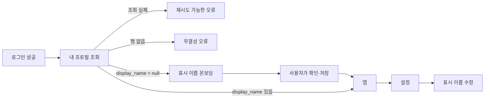

# 프로필 · 온보딩 · 설정 · 계정 삭제

로그인한 사용자를 위한 비공개 프로필을 만들고, 표시 이름이 없는 첫 로그인에는
온보딩을 거치게 한다. 같은 정보를 설정에서 확인·수정하고, 로그아웃과 전체 계정
삭제도 설정으로 모은다.

상위 결정은 다음과 같다.

- 일반 CRUD는 모바일이 Supabase에 직접 가고 RLS가 보안 경계다 —
  [hybrid-data-access](../../decisions/hybrid-data-access.md).
- 새 화면은 universal `@expo/ui`가 기본값이다 —
  [expo-ui-by-default](../../decisions/expo-ui-by-default.md).
- Apple 계정 삭제 token은 보관하지 않는다 —
  [no-apple-token-revocation](../../decisions/no-apple-token-revocation.md).
  *(이 스펙은 반대로 정했다가 구현 중에 뒤집혔다. 아래 §5·§6이 그 결과다.)*
- 이 스펙의 **프로필**은 공개 사용자 카드가 아니라
  [용어집](../../../GLOSSARY.md)의 비공개 계정 정보다.

## 확정 결정

### 1. 프로필은 인증 사용자와 1:1인 비공개 레코드다

`public.profiles`가 담는 값은 다섯 개뿐이다.

| 값 | 의미 |
| --- | --- |
| `id` | `auth.users.id`를 참조하는 기본키. 인증 사용자 삭제 시 함께 삭제 |
| `email` | 앱에서 조회하기 위한 이메일 복제본. 사용자는 읽기만 가능 |
| `display_name` | 사용자가 정하는 표시 이름. 처음에는 `null` |
| `created_at` | 프로필 생성 시각 |
| `updated_at` | 프로필이 마지막으로 바뀐 시각 |

- `email`의 원본은 `auth.users`다. 생성 때 복사하고, Auth 이메일이 바뀌면
  프로필도 따라간다. 앱은 수정할 수 없다.
- `display_name`은 중복을 허용한다. 앞뒤 공백을 제거한 뒤 1~50자이며, 사용자만
  자기 값을 수정할 수 있다.
- `updated_at`은 클라이언트가 보내지 않고 DB가 변경 때 갱신한다.
- RLS와 열 권한을 함께 쓴다. 인증 사용자는 자기 행을 조회하고
  `display_name`만 수정한다. 생성·삭제·이메일 변경은 클라이언트 권한이 아니다.
- 현재 기존 사용자가 없으므로 backfill은 만들지 않는다.

`avatar_url`, `username`, 이름 분할, `bio`, `website`, 권한·플랜·인증 provider는
프로필에 넣지 않는다.

### 2. 프로필 행은 사용자 생성과 같은 경계에서 생긴다

`auth.users` 생성 trigger가 `id`, `email`, timestamp를 가진 프로필을 만든다.
세션이 앱에 돌아왔을 때 프로필 행은 이미 존재해야 한다.

- 프로필 행이 있고 `display_name`이 `null`이면 정상적인 첫 온보딩이다.
- 프로필 행이 없으면 온보딩으로 가장하지 않고 데이터 무결성 오류를 보여준다.
- 조회 실패는 네트워크·권한 오류다. 재시도할 수 있어야 하며 `null`과 섞지 않는다.
- trigger 실패는 가입 자체를 막을 수 있으므로 이메일 OTP 실제 가입 경로로도
  검증한다.

### 3. 표시 이름이 없으면 앱보다 온보딩이 먼저다

- Apple·Google에서 이름 후보를 얻으면 입력칸에 미리 채우되 자동 저장하지 않는다.
- 이메일 OTP는 빈 입력칸으로 시작한다.
- 어느 경로든 사용자가 제출해야 프로필의 `display_name`이 된다.
- 이후 로그인은 provider 이름으로 사용자가 정한 값을 덮어쓰지 않는다.
- 별도 `onboarding_completed` 값은 두지 않는다. 지금의 완료 조건은
  `display_name is not null` 하나다.
- 온보딩은 뒤로 가서 앱에 진입할 수 없다.

### 4. 설정은 프로필과 계정 수명 주기를 한곳에 모은다

설정은 iOS 네이티브 Form 관용으로 만든다. 현재 홈의 로그아웃은 설정으로 옮기고
중복 노출하지 않는다. 홈에서는 우측 상단의 네이티브 설정 버튼으로 진입한다.

**프로필**

- 표시 이름: 현재 값을 보여주고 편집 화면으로 push
- 이메일: 읽기 전용으로 표시

**계정**

- 로그아웃
- 계정 삭제: destructive 역할과 명시적 확인을 거친다

온보딩과 설정의 표시 이름 편집은 같은 검증·저장 규칙을 공유한다. 설정 화면은
제품 도메인이 정해지지 않은 지금도 유효한 계정 표면만 담고, 빈 일반 설정 항목을
미리 만들지 않는다.

### 5. 계정 삭제는 Supabase hard delete다

계정 생성 기능이 있는 App Store 앱은 앱 안에서 전체 계정 삭제를 시작할 수
있어야 한다(Guideline 5.1.1(v)). 일시 비활성화나 로그아웃으로 대신하지 않는다.

삭제 순서는 다음과 같다.

1. 현재 인증 세션과 명시적 destructive 확인으로 요청 의도를 확인한다.
2. 사용자 소유 Storage 객체가 생겼다면 먼저 삭제한다. 현재는 없다.
3. Hono의 서버 전용 Supabase admin client가 Auth 사용자를 hard delete한다.
4. `on delete cascade`로 프로필과 현재 사용자 소유 throwaway 데이터가 삭제된다.
5. 앱은 로컬 세션과 사용자 캐시를 비우고 로그인 화면으로 돌아간다.

- Supabase 삭제가 성공한 뒤 로컬 정리가 실패해도 서버 계정을 되살리지 않는다.
  로컬 데이터를 강제로 버리고 signed-out 상태로 간다.
- 삭제 endpoint는 Hono를 거친다. secret/admin 권한을 모바일에 노출하지 않는다.
- soft delete는 사용하지 않는다.

### 6. Apple 승인 취소는 하지 않는다

**이 절은 원래 정반대였다.** Apple 로그인 때 authorization code를 서버로 보내
refresh token으로 교환·보관했다가 삭제 직전에 취소하는 흐름을 정했었고, 실제로
구현까지 했다가 걷어냈다.

Apple 문서에서 계정 삭제는 요구(`must`)이고 token 취소는 권고(`should`)인데,
그 권고를 위해 만든 기계가 취소 실패 시 삭제를 중단시켜 **요구 쪽을 막고
있었다.** 실제 `.p8` 키가 없는 지금은 Apple 사용자가 계정을 아예 지울 수
없었다.

근거와 대가는 [no-apple-token-revocation](../../decisions/no-apple-token-revocation.md)에
있다. 사용자의 Apple ID에 flyn 항목이 남는 것이 받아들인 대가다.

## 검증 기준

- DB trigger가 새 Auth 사용자와 1:1 프로필을 만들고 삭제 cascade가 동작한다.
- 본인은 자기 프로필을 읽고 표시 이름만 수정할 수 있다.
- 타인과 anon은 이메일을 포함한 프로필을 읽거나 바꿀 수 없다.
- 빈 문자열·공백뿐인 이름·51자 이름은 거부되고, 유효한 이름은 trim돼 저장된다.
- 이메일 OTP 첫 가입은 온보딩으로, 같은 사용자의 다음 로그인은 앱으로 간다.
- Apple·Google 이름 후보는 저장 전 사용자가 확인하고, 이후 로그인이 덮어쓰지 않는다.
- 프로필 조회 오류와 행 없음이 온보딩으로 잘못 분류되지 않는다.
- 설정에서 이름 변경, 로그아웃, 계정 삭제의 성공·취소·실패 상태가 구분된다.
- 계정 삭제는 Apple 취소 실패 시 중단되고, 전체 성공 시 서버 데이터와 로컬
  세션·캐시가 모두 사라진다.
- 소셜 로그인·Apple token 취소는 실기기에서 수동 검증하고, 나머지 경로는 이메일
  OTP와 pgTAP/API/UI 테스트로 자동 검증한다.

## 가정

- 설정과 온보딩은 RN 경계가 없는 Form이므로 universal `@expo/ui`로 충분하다.
  반증이 나오면 해당 화면만 RN으로 내리고 다른 화면을 함께 바꾸지 않는다.
- 표시 이름은 사용자가 나중에도 바꿀 수 있다.
- 계정 삭제 확인은 한 번의 명시적 destructive 확인으로 충분하다. 별도 비밀번호가
  없는 로그인 구조에서 provider별 재인증을 강제하지 않는다.
- 이메일 변경 UI는 만들지 않지만 Auth 원본이 바뀌면 DB가 복제본을 동기화한다.

## 범위 밖

- 공개 프로필, 사용자 검색, username, avatar, bio
- 탭 내비게이션이나 제품 화면 재설계
- 이메일 변경 화면
- 추가 소셜 로그인
- 계정 일시 비활성화와 soft delete
- 구독 취소·법적 보존 정책. 구독과 제품 도메인이 정해질 때 삭제 전 안내와
  보존 예외를 별도로 설계한다.

## 남은 리스크

- Apple token 교환에는 Apple client secret을 만드는 개발자 키와 서버 secret
  관리가 필요하다. 실제 키·token으로 실기기 검증하기 전까지 통합 성공은
  확정할 수 없다.
- Supabase Auth 사용자를 삭제해도 이미 발급된 access token은 만료 전까지
  암호학적으로 유효할 수 있다. 현재 데이터는 Auth FK cascade로 사라지고 새 쓰기는
  FK가 막지만, 이후 사용자 테이블도 같은 소유권 FK 원칙을 지켜야 한다.
- Storage 객체가 생기면 Auth 사용자 삭제 전에 소유 객체를 지우는 단계가
  필수다. 지금은 객체가 없으므로 경로만 남긴다.
- 제품 도메인이 정해져 보존 의무나 구독이 생기면 hard delete 직전 절차를 다시
  열어야 한다.
