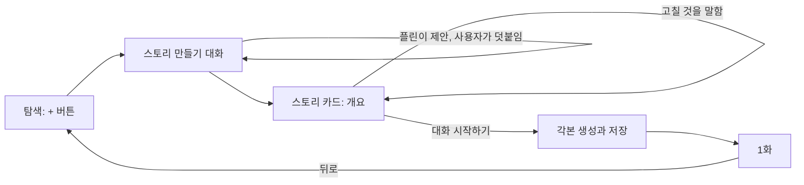

# 스토리 만들기 대화

상태: 승인. 사용자가 2026-09-10에 인터뷰 방식, 스토리 카드, `대화 시작하기`에서
각본을 만드는 순서, 탐색 탭 진입을 채팅으로 확정했다. 비교 시안은 결정을 받은 뒤
버렸고, 확정한 흐름 전체(탐색의 + 버튼, 스토리 만들기 대화, 스토리 카드, 대화 시작하기,
1화)는 [프로토타입](prototype.html)에 있다. 브라우저에서 열면 대화를 직접 눌러
볼 수 있고, 탐색 화면의 `만든 뒤` 상태와 스토리 만들기 화면의 `카드` 상태로 바로
건너뛸 수 있다.

## 사용자가 얻는 것

곧 겪을 자기 상황(다음 달 출장, 새로 온 외국인 동료, 이사 간 동네)을 플린과
이야기하며 자기만의 스토리로 만들고, 그 자리에서 바로 플레이한다. 만든 스토리는
만든 사람에게만 보이고, 공식 스토리와 같은 규칙으로 플레이한다.

인터뷰에서 확인한 니즈는 "본인만의 스토리"였고, 그 뜻은 장르를 고르는 것이 아니라
자기 실제 상황을 미리 겪어 보는 것이었다.

## 범위와 동작

### 여는 자리

- 탐색 탭 헤더 오른쪽에 + 아이콘 버튼을 둔다. 사용자가 지정한 대로
  `Stack.Toolbar.Button`을 쓰고, 글자 대신 아이콘만 보이며, 접근성 이름은
  `스토리 만들기`다.
- 버튼은 `스토리 만들기` 화면을 연다. 화면 제목도 `스토리 만들기`다. 탭 바깥에서
  열어 하단 탭을 표시하지 않고, 뒤로 가면 탐색으로 돌아간다.
- 탐색 목록 위에 필터 칩 `전체`와 `내 스토리`를 둔다. `전체`는 내가 만든 스토리를
  위에, 공식 스토리를 아래에 이어서 보여 주고, `내 스토리`는 내가 만든 것만 보여 준다.
  구역 제목은 두지 않으므로 옛 제목 `모든 스토리`는 없앤다. 공식 스토리에는 화면에서
  이름을 붙이지 않는다.
- 필터는 만든 스토리가 없어도 보인다. 그때 `내 스토리`를 고르면 목록 자리 중앙에
  `아직 내 스토리가 없어요.`와 Primary `스토리 만들기` 버튼을 보여 주고, 버튼은
  헤더의 + 버튼과 같은 화면을 연다.
- 만든 스토리는 만든 사람에게만 보인다. 탐색, 스토리 탭, 상세, 대화 기록 어디에서도
  다른 사람의 만든 스토리가 보이지 않는다.

### 같이 다듬는 대화

- `스토리 만들기` 화면은 플린과 나누는 채팅이다. 입력창, 스트리밍, 답변 대기 표시,
  메시지 동작은 에피소드와 `AI에게 물어보기`가 쓰는 공통 대화 표현을 그대로 쓴다.
- 대화는 플린의 고정 첫마디 `어떤 상황을 만들고 싶어요?`로 시작한다. 이 문장은
  모델이 쓰지 않는다.
- 플린은 진단이나 설문을 하지 않는다. 어디서, 누구와, 무엇이 걱정인지 순서대로
  묻지 않고, 사용자가 말한 상황에서 먼저 사건과 인물을 구체적으로 제안한다.
  예를 들어 발표 상황이면 "발표 중간에 담당자가 말을 끊고 숫자 근거를 묻는 장면"을
  던지고 그것이 맞는지 묻는다.
- 한 번에 하나만 묻는다. 양자택일 선택지 버튼은 두지 않는다. 사용자는 답에
  "경쟁사랑 자꾸 비교하는 사람"처럼 뉘앙스를 덧붙일 수 있어야 한다.
- 사용자가 "그냥 만들어 줘"처럼 더 묻지 말라고 하면 플린은 그때까지 들은 것으로
  바로 스토리 카드를 내놓는다.
- 대화는 한국어로 한다. 사용자가 영어로 써도 플린은 한국어로 답한다.

### 스토리 카드

- 플린이 충분히 알았다고 판단하면 정리 문장을 따로 쓰지 않고 스토리 카드를
  내놓는다. 카드는 제목, 한 줄 소개, 등장인물(이름과 역할 한 줄), 화별 제목과
  상황 설명 한 줄을 보여 주고, 아래에 Primary `대화 시작하기`를 둔다. 상황 설명은
  스토리 상세의 에피소드 목록에 보이는 그 문장이다.
- 카드는 대화 흐름 안에 놓이고 입력창은 그대로 열려 있다. 플린은 카드 뒤에
  `고칠 게 있으면 말해 주세요.`라고 말한다.
- 사용자가 "2화는 빼 줘", "호텔 직원은 무뚝뚝했으면 좋겠어요"처럼 고칠 것을 말하면
  플린이 새 카드를 내놓는다. 사용자가 말하지 않은 부분은 그대로 둔다. 지난 카드는
  대화에 남되 `대화 시작하기`는 가장 최근 카드에만 붙는다.
- 화 수의 기본값은 3화다. 사용자가 대화로 늘리거나 줄일 수 있고 상한은 5화다.
- 카드에는 개요만 있다. 각본은 이 단계에서 만들지 않는다.

### 대화 시작하기

- `대화 시작하기`를 누르면 가장 최근 카드의 개요대로 모든 화의 각본과 스토리의 소개,
  완주 안내를 만들고 저장한 뒤 1화를 연다. 저장은 이 시점에 처음 일어난다. 카드가 몇
  번 바뀌어도 `대화 시작하기` 전에는 어디에도 스토리가 생기지 않는다.
- 만드는 동안 버튼은 [모바일 작업 진행 표시](../../decisions/mobile-action-progress.md)를
  따라 진행 중임을 보여 주고, 같은 요청을 다시 시작하지 못하게 한다.
- 1화는 공식 스토리의 1화와 같은 방식으로 열린다. 첫 장면은 저장한 각본에서 읽고,
  첫 사용자 메시지에 회차가 생긴다. 1화에서 뒤로 가면 탐색으로 돌아가고
  `스토리 만들기` 화면은 남지 않는다.
- 만들기에 실패하면 [모바일 스토리 탐색](../../decisions/mobile-story-browsing.md)의
  시작 실패와 같은 알림(`닫기`, `다시 시도`)을 `스토리 만들기` 화면 위에서 보여 준다.
  닫으면 카드와 대화가 그대로 남고, 다시 시도는 같은 카드로 다시 만든다. 실패한
  시도는 탐색의 `내 스토리`에도 회차에도 아무것도 남기지 않는다.
- `스토리 만들기` 화면을 나가면 대화와 카드는 사라진다. 다시 열면 첫마디부터
  시작한다.

### 만든 뒤

- 만든 스토리는 탐색의 `전체`와 `내 스토리`에 만든 순서의 역순으로 보인다. 표지
  그림은 없고 표지 자리는 빈 색 상자다.
- 만든 스토리의 상세, `대화 시작하기`, 대화 기록, 회차, 이야기 기억, 교정,
  `AI에게 물어보기`, 표현 돌아보기, 결말과 완주 안내는 공식 스토리와 같다.
  플레이하면 스토리 탭의 최근 대화에도 같은 규칙으로 나타난다.
- 계정을 삭제하면 그 사람이 만든 스토리와 각본도 함께 지운다.
- 공식 콘텐츠 seed를 다시 실행해도 만든 스토리는 바뀌거나 지워지지 않는다.

### 각본이 지켜야 할 것

플린이 쓰는 각본은 공식 콘텐츠와 같은 구성과 규칙을 따른다.

- 화마다 상황 줄 문구와 이모지, 첫 장면, 무대, 등장인물 이름 목록, 성공·타협·실패
  결말 기준을 갖춘다. 화의 제목과 상황 설명은 카드의 개요에서 그대로 온다. 스토리에는
  소개 문단과 완주 안내가 있다.
- 인물 대사는 영어, 지문은 한국어다. 대사는 줄 머리에 `이름:`을 붙이고, 그 이름은
  그 화의 등장인물 목록에 있어야 한다. 무대에는 새 인물을 만들지 않는다는 지시를
  넣는다.
- 첫 장면은 이미 문제가 벌어진 자리에서 시작하고, 사용자가 말을 해야 풀린다.
- 사건은 분기하지 않는다. 각 화의 사건은 앞 화가 어느 결말로 끝났든 성립해야 한다.
- 모든 글은 공식 콘텐츠의 길이 한도 안에 든다.

## 완료 기준

- 탐색 헤더의 + 버튼은 화면 읽기 기능에서 `스토리 만들기`로 읽히고, 누르면 탭 없이
  `스토리 만들기` 화면이 열린다. 뒤로 가면 탐색으로 돌아온다.
- 화면을 열면 플린의 `어떤 상황을 만들고 싶어요?`가 입력 없이 먼저 보인다.
- 상황 한 문장을 보내면 플린의 다음 말에 구체적인 사건이나 인물 제안이 있고, 질문은
  하나다. 화면에 선택지 버튼이 없다.
- 두세 번 오간 뒤 스토리 카드가 나온다. 카드에 제목, 한 줄 소개, 등장인물, 화별
  제목과 상황 설명, `대화 시작하기`가 있고 입력창은 열려 있다.
- "2화는 빼 줘"를 보내면 새 카드의 화 수가 하나 줄고, 남은 화의 제목과 등장인물은
  이전 카드와 같다.
- "그냥 만들어 줘"를 보내면 더 묻지 않고 카드가 나온다.
- `대화 시작하기`를 누르면 버튼이 진행 중을 보여 주고 두 번 눌리지 않으며, 끝나면 1화가
  첫 장면부터 열린다. 1화에서 뒤로 가면 탐색이고, `전체` 목록 맨 위와 `내 스토리`
  목록에 방금 만든 스토리가 있다.
- 1화의 대사는 영어, 지문은 한국어이고, 화자 이름은 카드의 등장인물 안에 있다.
  결말은 성공·타협·실패 중 하나로 난다.
- `대화 시작하기`를 누르지 않고 화면을 나가면 `내 스토리`에 아무것도 생기지 않는다.
  만들기 실패 뒤에도 같다.
- 다른 계정으로 로그인하면 그 스토리가 탐색과 스토리 탭 어디에도 없다.
- 만든 스토리를 플레이한 뒤 계정을 삭제하면 그 스토리, 각본, 회차가 남지 않는다.
- 공식 seed를 다시 실행한 뒤에도 만든 스토리와 그 회차가 그대로다.
- 만든 스토리가 없을 때도 탐색에 `전체`와 `내 스토리` 칩이 보인다. `전체`에는 기존
  공식 스토리 다섯 개가 그대로 있고, `내 스토리`에는 `아직 내 스토리가 없어요.`와
  `스토리 만들기` 버튼이 보이며 그 버튼은 `스토리 만들기` 화면을 연다.
- 칩 이름은 큰 접근성 글자 크기에서도 잘리지 않고, 칩 줄은 화면보다 길어지면 가로로
  스크롤한다.

## 결정 이유

- **만들고 싶은 것을 묻는다.** "요즘 영어가 필요한 자리가 어디예요?"로 시작하는
  진단형 시안 세 개(고정 세 질문, 한 문장 뒤 되묻기, 한 번에 적기)를 사용자가 전부
  반려했다. 사용자는 연습할 곳을 신고하는 사람이 아니라 상황을 만드는 사람이다.
- **같이 다듬기.** 답 하나로 바로 초안을 만드는 방식과 비교해 사용자가 같이 다듬기를
  골랐다. 플린이 먼저 사건을 던지는 예시 대화를 "이대로"로 승인했다.
- **컴포넌트는 스토리 카드 하나.** 글만 쓰는 방식은 "좋아요"가 동의인지 시작
  신호인지 플린이 헷갈리고 정리가 대화 속으로 흘러간다. 선택지 버튼까지 두는 방식은
  뉘앙스를 덧붙일 자리를 없애고 설문 느낌이 돌아온다. 카드와 버튼은 에피소드가
  결말을 완료 카드로, 교정을 배울 표현 카드로 보여 주는 기존 문법과 같다.
  GPT Builder는 채팅을 글로만 두고 구조를 옆 Configure 패널에 뺐는데, 폰에는 옆
  패널이 없으니 카드 하나가 그 역할을 맡는다.
- **개요는 대화 중에, 각본은 `대화 시작하기`에서.** 사용자가 카드에서 판단하는 것은
  개요뿐이고 각본은 화면에 보이지 않는다. 각본을 확정 뒤 한 번만 만들면 카드를 몇
  번 고쳐도 비용이 들지 않고, 저장이 `대화 시작하기`로 미뤄져 버린 시도가 목록에 쌓이지
  않는다. 이 결정으로 정리 카드와 `이대로 만들기` 단계가 할 일을 잃어 스토리 카드
  하나로 합쳤다.
- **각본 생성 시간은 문제가 아니다.** 실제 모델(GPT 5.6 Luna)로 재 본 결과다.

  | 생성 | 걸린 시간 | 출력 |
  | --- | --- | --- |
  | 개요 카드 | 5.3초 | 485토큰 |
  | 각본 3화를 한 번에 | 17.6초 | 1,688토큰 |
  | 각본 3화를 화별로 동시에 | 12.7초 | 화당 630–690토큰 |

  긴 장면 하나를 기다리는 시간과 비슷해 1화만 먼저 만드는 장치는 두지 않는다. 5화를
  한 번에 만들면 30초 가까이 되므로 기본값을 3화로 잡았다.
- **탐색 탭.** 결정 계약이 탐색을 "플레이할 스토리를 찾는 곳"으로 정했고 만든
  스토리도 플레이할 스토리다. GPT 스토어가 같은 구조로, 둘러보는 화면에 `Create`와
  `My GPTs`가 함께 있다. 스토리 탭은 대화한 스토리의 최근순 목록이라 만든 스토리가
  섞이면 정렬 규칙이 꼬인다. 홈은 결정 계약이 영어 학습 공간으로 남겨 두었다.
- **구역 제목 대신 필터 칩.** 처음에는 `내가 만든 스토리`와 `플린이 만든 스토리`
  두 구역으로 그렸는데, 공식 스토리에 붙일 이름이 어느 것도 자연스럽지 않았다.
  `플린이 만든`은 플린을 작가로 만들고, `모든 스토리`는 내 것 아래에서 뜻이 겹치며,
  `추천`과 `기본`은 없는 뜻을 만든다. 필터로 바꾸면 `전체`와 `내 스토리`만 있으면
  되고 공식 스토리에는 이름이 필요 없다. 세그먼트와 상단 탭도 그려 보았지만 이건
  화면을 나누는 일이 아니라 같은 목록을 거르는 일이라 필터 칩을 골랐다. 앱스토어와
  유튜브가 목록 필터에 쓰는 모양이고 값이 늘어도 옆으로 이어 붙일 수 있다.
  칩 이름은 한국 앱의 `내 ○○` 관용(제타의 `내 캐릭터`, 밀리의서재의 `내 서재`)을
  따르고, `나만의 스토리`는 작은 화면에서 길어서 뺐다.
- **사람이 쓰는 각본 원칙과의 관계.** [에피소드 콘텐츠 제작](../../decisions/episode-authoring.md)이
  "모델이 사건과 첫 장면을 생성하기"를 제외한 이유는 플레이 중 즉석 생성이 첫 장면
  대기, 형식 위반, 예고 불일치를 만들기 때문이다. 여기서는 사건이 사용자가 확정한
  개요에 있고 각본이 첫 플레이 전에 전부 저장되므로 그 문제가 생기지 않는다. 플레이
  규칙은 바꾸지 않는다.

## 가정

바꿀 수 있는 기본값이다. 사용자가 다른 뜻을 밝히면 그쪽을 따른다.

- `스토리 만들기` 화면은 스토리 상세처럼 탭 바깥의 상세 계층으로 민다. 시트로 열지
  않는다.
- 첫마디는 고정 문구다.
- 화 수 기본 3화, 상한 5화.
- 표지 그림은 없다. 빈 색 상자를 그대로 둔다.
- `전체`에서 만든 스토리는 공식 스토리보다 위에, 만든 순서의 역순으로 놓인다.
- 필터는 만든 스토리가 없어도 늘 보인다. 만들 수 있다는 사실을 칩이 알려 준다.
- 탐색을 다시 열면 필터는 `전체`로 돌아간다.
- 카드 다시 만들기 횟수에 제한을 두지 않는다.
- 화면을 나가면 대화와 카드가 사라진다. `AI에게 물어보기`와 같은 수명이다.
- 만들기 실패 알림은 시작 실패와 같은 모양이다.
- 1화에서 뒤로 가면 탐색이다.
- 대화 언어는 한국어다.

## 제외

- 공유, 게시, 공개 범위, 신고, 리믹스. [스토리 구조](../../decisions/story-structure.md)와
  [모바일 스토리 탐색](../../decisions/mobile-story-browsing.md)이 별도 제품 정의로
  미뤘고, 이 스펙은 만든 사람에게만 보이는 범위에서 끝난다.
- 표지 그림 생성.
- 장르나 세계를 고르는 흐름. 인터뷰가 확인한 니즈가 아니다.
- 양자택일 선택지 버튼과 정리 카드. 사용자가 반려했다.
- 만드는 대화의 저장과 이어서 만들기.
- 공식 스토리의 제작 방식. 사람이 각본을 쓰는 원칙은 그대로다.
- 홈 탭. 바꾸지 않는다.
- 1화만 먼저 만들고 나머지를 뒤에 만드는 장치. 측정 결과로 필요 없다고 판단해
  버렸다.

## 미결

- **만든 스토리의 수정과 삭제.** dogfooding 뒤에 정한다. 그때까지는 고칠 수 없고,
  마음에 안 들면 새로 만든다.
- **플린이 카드를 내놓는 시점의 기준.** 몇 번 오간 뒤가 적당한지는 실제 대화를 보고
  조정한다. 그때까지는 사건 하나와 상대 하나가 정해지면 카드를 내놓는 것을 기준으로
  삼는다.
- **공유와 공개.** 별도 제품 정의.

## 남은 위험

- **각본 품질.** 측정에서 모델은 첫 장면은 seed와 비슷하게, 무대 지시는 seed의 3분의
  2 길이로 썼다. 사건이 약하거나 인물의 태도가 흐릿한 각본이 나올 수 있다. 공식
  seed를 형식 예시로 주는 것이 첫 대응이다.
- **다시 만들기의 흔들림.** "2화 빼 줘"에 1화 제목까지 바뀔 수 있다. 완료 기준에
  넣었지만 모델 출력이라 보장은 아니다.
- **`대화 시작하기` 대기.** 3화 기준 13–18초다. 진행 표시만 있고 취소는 없다.
- **카드 시점 편차.** 플린이 너무 일찍 카드를 내놓으면 밋밋하고, 너무 늦으면
  설문처럼 느껴진다.
- **개인 정보.** 사용자가 실제 회사와 사람 이름을 넣을 수 있고 그것이 각본에
  저장된다. 지금은 본인에게만 보여 문제가 없지만, 공유를 열 때 다시 본다.
- **노출.** 탐색은 지금 로그인한 모든 사용자에게 모든 스토리를 보여 준다. 만든
  사람에게만 보이는 제한이 함께 가지 않으면 남의 스토리가 탐색에 뜬다.

## 근거

- 2026-09-10 비교 시안 네 번: 묻는 방식(전부 반려), 컴포넌트 범위(카드 하나),
  초안이 놓이는 자리(대화 안, 입력창 열림)와 여는 자리(탐색), 탐색의 필터 모양(칩).
  시안은 결정 뒤 버렸고 결과는 프로토타입에 반영했다.
- 2026-09-10 생성 시간 측정. 작업 폴더 밖에서 이 프로젝트의 게이트웨이와 모델로
  베를린 출장 개요를 주고 seed 형식으로 쓰게 했다. 표는 결정 이유에 있다.
- 업계 기준선: GPT Builder(대화로 초안, Configure로 편집, Preview로 시험, GPT
  스토어에 Create와 My GPTs), Character.AI Quick Creation과 제타(폼 입력). 어느 쪽도
  여러 화짜리 완결 묶음을 만들어 주지 않는다.
