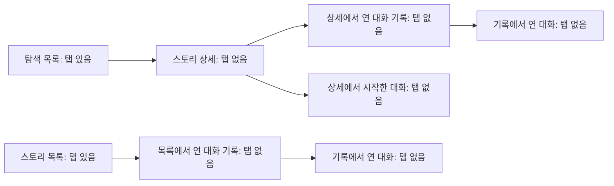

# 스토리 상세와 대화의 탭 없는 이동

상태: 승인. 사용자가 2026-09-09에 탭 배치 기준과 상세·대화 기록을 탭 바깥에서
여는 방향을 확인하고 결정 문서와 명세 작성을 요청했다. 구현과 기기 검증은 남아 있다.

## 사용자가 얻는 것

스토리 상세, 대화 기록과 대화 사이를 오갈 때 하단 탭이 잠깐 나타났다 사라지지
않는다. 뒤로 가면 자신이 들어왔던 화면으로 돌아가고, 목록에 돌아오면 다시 탭으로
다른 영역을 오갈 수 있다.

## 현재 문제와 근거

사용자는 스토리에서 대화로 들어갔다 나올 때 탭이 보였다 사라지는 현상을 보고했다.
현재 코드는 상세와 기록에서 탭을 숨기지만, 그 위에 대화를 열면 뒤에 있는 탭의
숨김 상태를 해제한다. 돌아오면 다시 숨긴다.

주소별 상태 변화는 작업 폴더 밖의 작은 실험으로 확인했다. 기기의 전환 장면은
아직 재현하지 않았으므로 깜빡임의 정확한 시점이나 플랫폼별 차이를 확정하지 않는다.
검증한 버전과 공식 문서는 [탭 배치 결정](../../decisions/mobile-tab-navigation.md)에 있다.

## 범위와 동작

### 탭이 보이는 화면

- 홈, 탐색 목록과 스토리 목록은 하단 탭으로 다른 영역을 오갈 수 있다.
- 스토리 상세, 대화 기록과 에피소드 대화는 탭 바깥에서 열며 하단 탭을 표시하지 않는다.
- 탭이 없는 화면에서 다른 탭 없는 화면을 열거나 돌아오면, 전환 도중에도 탭이
  잠깐 나타나지 않는다.
- 목록과 상세 사이에서는 운영체제의 화면 전환에 따라 원래 목록과 그 탭이 함께
  드러나거나 가려진다. 상세 전환이 끝난 뒤 탭만 뒤늦게 나타나거나 사라지지 않는다.
- 데이터를 불러오는 중이거나 빈 상태, 조회 실패 상태여도 해당 화면의 탭 표시와
  뒤로 가기는 달라지지 않는다.

### 진입 경로별 돌아가기

| 사용자가 이동한 순서 | 대화에서 뒤로 간 뒤의 복귀 순서 |
| --- | --- |
| 탐색 목록 → 스토리 상세 → 대화 | 스토리 상세 → 탐색 목록 |
| 탐색 목록 → 스토리 상세 → 대화 기록 → 대화 | 대화 기록 → 스토리 상세 → 탐색 목록 |
| 스토리 목록 → 대화 기록 → 대화 | 대화 기록 → 스토리 목록 |

- `대화 시작하기`, `새 대화`, 진행 중인 회차 이어 가기와 끝난 화 열기에 같은
  복귀 기준을 적용한다. 끝난 화는 계속 읽기 전용으로 연다.
- 대화 기록을 어느 경로에서 열었든 선택한 스토리, 회차와 화를 그대로 사용한다.
  화면 이동 때문에 다른 탭이나 다른 회차를 자동으로 선택하지 않는다.
- 새 대화를 열고 입력하지 않은 채 돌아오면 시작했던 상세 또는 기록으로 돌아간다.
  화면을 열고 닫았다는 이유로 새 기록을 추가하지 않는다.
- 다음 화를 진행한 뒤에도 뒤로 가기는 처음 대화를 열었던 상세 또는 기록으로
  돌아간다. 이전 화를 차례로 닫아야 목록으로 돌아오는 흐름으로 바꾸지 않는다.
- `AI에게 물어보기`를 닫으면 보고 있던 대화로 돌아오며, 그 뒤에도 같은 복귀 경로를
  유지한다. 시트를 열고 닫는 동안 탭이 나타나지 않는다.

뒤로 가기는 각 화살표의 반대 순서로 이동한다. 그림은 사용자의 진입 경로를
구분하며, 같은 내용의 화면을 별개로 구현하라는 뜻은 아니다.

### 기존 화면과 행동

- 홈·탐색·스토리의 역할, 기록의 정렬과 회차 선택은
  [모바일 스토리 탐색](../../decisions/mobile-story-browsing.md)을 따른다.
- 상세의 하단 시작 버튼, 기록의 헤더 `새 대화`, 회차 카드와 빈 안내는 유지한다.
  화면 배치를 바꾸기 위해 버튼이나 확인 단계를 추가하지 않는다.
- 화면마다 기존 헤더 하나를 유지한다. 뒤로 가기와 제스처는
  [모바일 뒤로 가기 표시](../../decisions/mobile-back-button-display.md)를 따른다.
- 대화 시작에 실패하면 시도한 화면에 머문다. 실패 안내를 닫거나 다시 시도해도
  복귀 경로와 탭 표시가 바뀌지 않는다.
- 대화와 표현 확인, 기록 저장은 [제품 정의](../../../PRODUCT.md)와 기존 계약을
  따른다. 이동 문제를 고치기 위해 새 저장 단계나 학습 기능을 추가하지 않는다.

## 완료 기준

- 위 표의 세 경로를 iOS와 Android에서 각각 끝까지 이동할 수 있고, 뒤로 갈 때
  표에 적은 화면과 탭으로 돌아온다. 열린 순서가 다른 기록 화면에서도 같은 내용을 본다.
- 상세에서 시작한 새 대화, 기록에서 시작한 새 대화, 진행 중인 회차와 끝난 화를
  각각 열고 돌아와도 탭이 잠깐 나타나지 않는다. 선택한 회차와 화가 바뀌지 않는다.
- 대화에서 다음 화로 넘어간 뒤 뒤로 가면 처음 대화를 열었던 화면으로 돌아간다.
- iOS에서 탭이 없는 화면끼리 뒤로 가기 제스처를 완료하거나 중간에 취소해도
  탭이 보이지 않는다. 취소하면 출발 화면에 그대로 머문다.
- iOS에서 첫 상세 또는 기록 화면에서 목록으로 돌아가는 제스처를 하면 원래
  목록과 탭이 함께 드러난다. 취소한 뒤 상세 화면에 탭이 남지 않고, 완료한 뒤에는
  목록의 탭을 바로 사용할 수 있다.
- Android에서 헤더 뒤로 가기와 시스템 뒤로 가기가 같은 복귀 경로를 따른다.
  기기에서 지원하는 시스템 제스처를 취소하면 출발 화면에 머문다.
- 빈 기록, 조회 중과 조회 실패 상태에서도 헤더의 뒤로 가기가 동작한다.
  탭을 가리거나 다시 표시하는 과정에서 본문과 하단 버튼이 갑자기 밀리지 않는다.
- 새 대화를 입력 없이 닫아도 기존 기록이 유지된다. 끝난 화를 열어보기만 해도
  새 회차가 생기거나 기존 대화와 결말이 바뀌지 않는다.
- `AI에게 물어보기`를 열고 닫은 뒤 같은 대화와 복귀 경로를 유지한다.
- 반복해서 들어갔다 나와도 헤더가 두 개 생기거나 뒤로 가기가 사라지지 않는다.
  목록으로 돌아온 뒤 홈·탐색·스토리 탭을 모두 사용할 수 있다.
- 화면에 필요한 하단 공간을 반영해 입력창, 시작 버튼과 마지막 기록 카드를 볼 수
  있다. 밝은 화면과 어두운 화면에서 전환 중 빈 배경이나 잘못된 탭이 드러나지 않는다.

## 결정 이유와 바꿀 수 있는 가정

- 사용자는 탭이 필요한 화면을 탭 안에 두고, 상세·기록·대화를 탭 바깥에서 여는
  기준을 확인했다. [모바일 탭과 상세 화면 배치](../../decisions/mobile-tab-navigation.md)를
  이번 작업의 제약으로 삼는다.
- 탭 표시 상태를 주소마다 바꾸는 대신 화면 배치와 원래 화면으로 돌아가기를 함께
  맞춘다. 네이티브 전환을 유지한다는 기존 원칙도 따른다.
- 별도 시안 검토는 반복하지 않는다. 사용자가 설명 그림과 화면 배치 방향을
  확인했고, 이번 작업은 기존 화면의 내용과 배치를 새로 고르는 작업이 아니다.
- 목록과 기록으로 돌아올 때 읽던 위치와 펼친 회차를 가능한 한 유지하는 것을
  기본값으로 삼는다. 대화 진행에 따른 정상 데이터 갱신은 허용하며, 정확한 스크롤
  복원 방식은 바꿀 수 있다.

## 제외와 남은 위험

- 홈 구성, 탐색 분류, 기록 카드와 대화 화면의 재설계는 제외한다. 탭 배치를 설명할
  때 사용한 장르별 목록은 새 기능 요청이 아니다.
- 서버, 데이터 저장 규칙, 인증과 의존성 버전은 이번 작업에서 바꾸지 않는다.
  화면 이동 문제를 해결하는 범위를 유지한다.
- 별도 논의 중인 에피소드 종료와 표현 돌아보기 화면은 만들지 않는다. 해당 명세의
  미정 사항을 이 작업에서 대신 결정하지 않는다.
- 공개 링크로 앱 밖에서 처음 들어오는 새 흐름과 복귀 정책은 범위 밖이다.
  기존 내부 이동 경로가 끊어지지 않아야 하며, 구현 중 이미 지원하던 외부 진입이
  확인되면 그 동작과 영향부터 확인한다.
- 필수 제품 결정은 남아 있지 않다. 기기별 전환 시점, 제스처 취소와 하단 공간은
  구현 후 실제 화면에서 확인할 사항이다. 주소별 조건 검사만으로 깜빡임이 사라졌다고
  판단하지 않는다.
